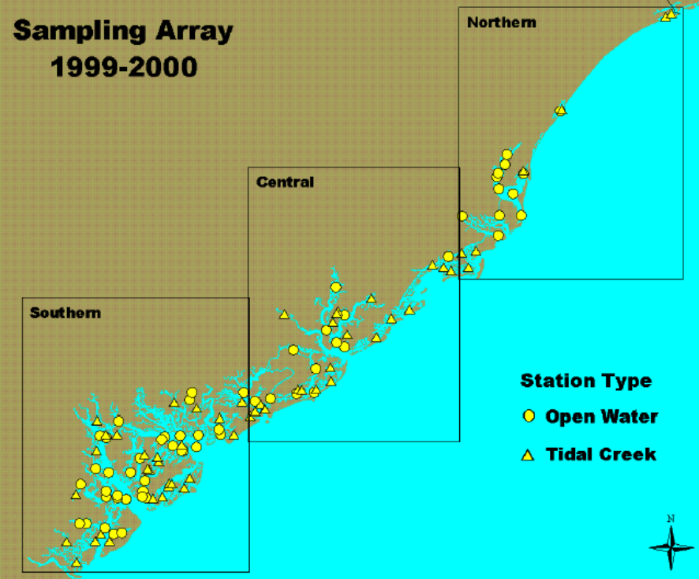

```{r, include = FALSE}
knitr::opts_chunk$set(
  collapse = TRUE,
  comment = "#>"
)
```

## Preliminaries
This document presents analysis of a GRTS survey design for an area resource.  The area resource used in the analysis is estuaries in South Carolina.  Although a stratified survey design was used to sample estuaries, analyses will be conducted as if the design was unstratified.  Instead, strata will be used to define subpopulations for analysis.  The strata employed in the survey were: (1) open water and (2) tidal creeks.  The analysis will include calculation of three types of population estimates: (1) estimation of proportion and size (area of estuaries) for site evaluation status categorical variables; (2) estimation of proportion and size for estuary condition categorical variables; and (3) estimation of the cumulative distribution function (CDF) and percentiles for quantitative variables.  Testing for difference between CDFs from subpopulations also will be presented.

The initial step is to use the library function to load the `spsurvey` package.  After the package is loaded, a message is printed to the R console indicating that the spsurvey package was loaded successfully.

Load the spsurvey package:
```{r load-spsurvey}
library(spsurvey)
```

## Load the survey design and analytical variables data set
The next step is to load the data set, which includes both survey design variables and analytical variables.  The data function is used to load the data set and assign it to a data frame named `SC_estuaries`.  The nrow function is used to determine the number of rows in the `SC_estuaries` data frame, and the resulting value is assigned to an object named `nr`. Finally, the initial six lines and the final six lines in the `SC_estuaries` data frame are printed using the head and tail functions, respectively.

Load the survey design and analytical variables data set:
```{r survey-data}
data(SC_estuaries)
nr <- nrow(SC_estuaries)
```

Display the initial six lines in the data file:
```{r head-survey-data}
head(SC_estuaries)
```

Display the final six lines in the data file:
```{r tail-survey-data}
tail(SC_estuaries)
```

The location of sample sites in South Carolina estuaries is displayed in the figure below.  The sites for each stratum are displayed using a unique color.



## Analysis of site status evaluation variables

The first analysis that will be examined is calculation of extent estimates for a site status evaluation variable.  Extent is measured both by the proportion of the resource in status evaluation categories and by size of the resource in each category.  For an area resource like estuaries, size refers to the area of estuaries in a category.  For calculating extent estimates (and for all of the analyses we will consider), survey design weights are incorporated into the calculation process.  Weights used in the analyses were modified from the original survey design weights to ensure that the weights sum to the known size of the resource.  Further information regarding weight adjustment is provided in the help page for the adjwgt (weight adjustment) function.  The site status variable named status will be examined, which classifies estuaries into two evaluation categories: "Sampled" and "NonTarget".  The table and addmargins functions are used to create tables displaying the count for each code (level) of the status variable.

Use the `table` and `addmargins` functions to create a table displaying the count for each code of the status variable:
```{r addmargins}
cat("\nA table displaying the number of values for each level of the status
variable follows:\n")
addmargins(table(SC_estuaries$Status))
```

The `cat.analysis` function in the `spsurvey` package will be used to calculate extent estimates.  Four data frames constitute the primary input to the `cat.analysis` function.  The first column (variable) in the four data frames provides the unique identifier (site ID) for each sample site and is used to connect records among the data frames.  The siteID variable in the `SC_estuaries` data frame is assigned to the siteID variable in the data frames.  The four data frames that will be created are named as follows: `sites`, `subpop`, `design`, and `data.cat`.  The sites data frame identifies sites to use in the analysis and contains two variables: (1) siteID - site ID values and (2) Use - a logical vector indicating which sites to use in the analysis.  The rep (repeat) function is used to assign the value TRUE to each element of the Use variable.  Recall that nr is an object containing the number of rows in the `SC_estuaries` data frame.  The subpop data frame defines populations and, optionally, subpopulations for which estimates are desired.  Unlike the `sites` and `design` data frames, the `subpop` data frame can contain an arbitrary number of columns.  The first variable in the `subpop` data frame identifies site ID values and each subsequent variable identifies a type of population, where the variable name is used to identify type.  A type variable identifies each site with a character value.  If the number of unique values for a type variable is greater than one, then the set of values represent subpopulations of that type.  When a type variable consists of a single unique value, then the type does not contain subpopulations.  For this analysis, the `subpop` data frame contains three variables: (1) siteID - site ID values, (2) All_Estuaries - which will be used to calculate estimates for all of the sample sites combined, and (3) Estuary_Type - which will be used to calculate estimates for each stratum individually.  The stratum variable in the `SC_estuaries` data frame is assigned to the Estuary_Type variable in the `subpop` data frame.  The `design` data frame consists of survey design variables.  For the analysis under consideration, the `design` data frame contains the following variables: (1) siteID - site ID values; (2) wgt - final, adjusted, survey design weights; (3) xcoord - x-coordinates for location; and (4) ycoord - y-coordinates for location.  The wgt, xcoord, and ycoord variables in the design data frame are assigned values using variables with the same names in the `SC_estuaries` data frame.  Like the `subpop` data frame, the `data.cat` data frame can contain an arbitrary number of columns.  The first variable in the data.cat data frame identifies site ID values and each subsequent variable identifies a response variable. The response variable is Status, which is assigned the status variable in the `SC_estuaries` data frame. Missing data (NA) is allowed for the response variables, which are the only variables in the input data frames for which NA values are allowed.

To conduct an analysis of site status evaluation variables, create the `sites` data frame, which identifies sites to use in the analysis. Note that all sites will be used to estimate number of estuaries in each category:
```{r sites2}
sites <- data.frame(siteID=SC_estuaries$siteID,
                    Use=rep(TRUE, nr))
```

Create the `subpop` data frame, which defines populations and subpopulations for which estimates are desired:
```{r subpop}
subpop <- data.frame(siteID=SC_estuaries$siteID,
                     All_Estuaries=rep("All Estuaries", nr),
							       Estuary_Type=SC_estuaries$Stratum)
```

Create the `design` data frame, which identifies the stratum code, weight, x-coordinate, and y-coordinate for each site ID:
```{r design}
design <- data.frame(siteID=SC_estuaries$siteID,
                     wgt=SC_estuaries$wgt,
                     xcoord=SC_estuaries$xcoord,
                     ycoord=SC_estuaries$ycoord)
```

Create the `data.cat` data frame, which specifies the variables to use in the analysis:
```{r data.cat}
data.cat <- data.frame(siteID=SC_estuaries$siteID,
                       Status=SC_estuaries$Status)
```

Use the `cat.analysis` function to calculate extent estimates for the site status evaluation variables:
```{r extent.estimates}
Extent_Estimates <- cat.analysis(sites, subpop, design, data.cat)
```

The extent estimates are displayed using the print function.  The object produced by `cat.analysis` is a data frame containing thirteen columns.  The first five columns identify the population (Type), subpopulation (Subpopulation), response variable (Indicator), levels of the response variable (Category), and number of values in a category (NResp).  A category labeled "Total" is included for each combination of population, subpopulation, and response variable.  The next four columns in the `data frame` provide results for the proportion (percent scale) estimates: the proportion estimate (Estimate.P), standard error of the estimate (StdError.P), lower confidence bound (LCB95Pct.P), and upper confidence bound (UCB95Pct.P).  Argument conf for `cat.analysis` allows control of the confidence bound level.  The default value for conf is 95, hence the column names for confidence bounds contain the value 95.  Supplying a different value to the conf argument will be reflected in the confidence bound names.  Confidence bounds are obtained using the standard error and the Normal distribution multiplier corresponding to the confidence level.  The final four columns in the data frame provide results for the size (units scale) estimates: the size estimate (Estimate.U), standard error of the estimate (StdError.U), lower confidence bound (LCB95Pct.U), and upper confidence bound (UCB95Pct.U).  Note that the size estimate for the Total category will be equal to the sum of the survey design weights.

Print the extent estimates
```{r print.extent.estimates}
print(Extent_Estimates)
```

The `write.csv` function is used to store the extent estimates as a comma-separated value (csv) file.  Files in csv format can be read by programs such as Microsoft Excel.
```{r write.extent.estimates}
write.csv(Extent_Estimates, file="Extent_Estimates.csv")
```

## Analysis of estuary condition variables
The second analysis that will be examined is estimating resource proportion and size for estuary condition variables.  Two estuary condition variables will be examined: (1) IBI_Status, which classifies estuaries by benthic IBI (index of biotic integrity) status categories and (2) WQ_Status, which classifies estuaries by WQ (water quality) status categories.  The `table` and `addmargins` functions are used to create tables displaying the count for each level of the two estuary condition variables.

Use the `table` and `addmargins` functions to create a table displaying the count for each code of the IBI status variable:
```{r addmargins2}
cat("\nA table displaying the number of values for each level of the IBI status
variable follows:\n")
addmargins(table(SC_estuaries$IBI_status))
```

Use the `table` and `addmargins` functions to create a table displaying the count for each code of the WQ status variable:
```{r addmargins3}
cat("\nA table displaying the number of values for each level of the WQ status variable follows:\n")
addmargins(table(SC_estuaries$WQ_status))
```

As for extent estimates, the `cat.analysis` function will be used to calculate condition estimates.  The `sites` data frame for this analysis differs from the one used to calculate extent estimates.  The Use logical variables in sites is set equal to the value "Sampled", so that only sampled sites are used in the analysis. The `subpop` and `design` data frames created in the prior analysis can be reused for this analysis.  The `data.cat` data frame contains the two estuary condition variables: IBI_Status and WQ_Status.  Variables IBI_status and WQ_status in the `SC_estuaries` data frame are assigned to IBI_Status and WQ_Status, respectively.

Conduct an analysis of estuary condition variables - create the `sites` data frame. Note that only sampled sites are used, and that the existing subpop and design data frames can be reused:
```{r sites}
sites <- data.frame(siteID=SC_estuaries$siteID,
                    Use=SC_estuaries$Status == "Sampled")
```

Create the `data.cat` data frame, which specifies the variables to use in the analysis:
```{r data.cat2}
data.cat <- data.frame(siteID=SC_estuaries$siteID,
                       IBI_Status=SC_estuaries$IBI_status,
                       WQ_Status=SC_estuaries$WQ_status)
```

Use the `cat.analysis` function to calculate estimates for the estuary condition variables - calculate estimates for the categorical variables:
```{r cond.est}
Condition_Estimates <- cat.analysis(sites, subpop, design, data.cat)
```

Print the estuary condition estimates for all sites combined:
```{r print.est}
print(Condition_Estimates[c(1:4, 13:16),])
```

Use the `write.csv` function to write the condition estimates as a csv file:
```{r write.csv}
write.csv(Condition_Estimates, file="Condition_Estimates.csv")
```

## Analysis of estuary condition variables correcting for population size
The frame is a data structure containing spatial location data in addition to other attributes regarding a resource of interest and is used to create a survey design.  A frame often takes the form of a shapefile. The frame can be used to obtain size values (e.g., area of estuaries) for the populations and subpopulations examined in an analysis.  Examination of the Estimates.U column in the `Condition_Estimates` data frame produced by `cat.analysis` reveals that the estimated Total value for both condition variables and each combination of population value and subpopulation value does not sum to the corresponding frame size value.  For example, the Total entry in the Estimate.U column for the IBI_status variable, population "All_Estuaries" and subpopulation "All Estuaries" is 698 square kilometers (rounded to a whole number).  This value is an estimate of the size of the sampled resource.  The corresponding frame size value is 734 square kilometers.  The popsize (population size) argument to `cat.analysis` provides a mechanism for forcing the size estimates to sum to a desired value, e.g., the frame size value.  Note that including popsize as an argument results in assigning the popsize value to the Total category of the size estimates.  Use of the popsize argument assumes that sites which were evaluated but not sampled were missing at random.  The missing at random asumption may not be a valid assumption, e.g., sites for which access was denied by the landowner may not be the same as sites that were sampled.  For the current analysis, we will assume that the assumption is valid.  As a first step for use of the popsize argument, the `combine` function is used to create a named vector of frame size values for each basin. Output from the function is assigned to an object named `framesize`.  The popsize argument is a list, which is a particular type of R object.  The popsize list must include an entry for each population type included in the subpop data frame, i.e., All_Estuaries and Estuary_Type for this analysis.  The `sum` function applied to framesize is assigned to the All_Estuaries entry in the popsize list.  Recall that the Estuary_Type population contains subpopulations, i.e., stratum categories.  When a population type contains subpopulations, the entry in the popsize list also is a list.  The `as.list` function is applied to framesize, and the result is assigned to the Estuary_Type entry in the popsize list.

Conduct an analysis of estuary condition using variables correcting for population size and assign frame size values:
```{r framesize}
framesize <- c("Open Water"=628.509298, "Tidal Creek"=105.829522)
```

Use the `cat.analysis` function to calculate estimates for the estuary condition variables:
```{r est.estimates}
Condition_Estimates_popsize <- cat.analysis(sites, subpop, design, data.cat,
   popsize=list(All_Estuaries=sum(framesize),
                Estuary_Type=as.list(framesize)))
```

Print the estuary condition estimates for all sites combined:
```{r print.est.estimates}
print(Condition_Estimates_popsize[c(1:4, 13:16),])
```

Use the `write.csv` function to write the condition estimates as a csv file:
```{r write.est.estimates}
write.csv(Condition_Estimates_popsize, file="Condition_Estimates_popsize.csv")
```

## Analysis of quantitative variables
The third analysis that will be examined is estimating the CDF and percentiles for quantitative variables.  Two quantitative variables will be examined: (1) IBI_score - IBI score and (2) WQ_score - WQ score.  The summary function is used to summarize the data structure of the two quantitative variables.

Use the summary function to summarize the data structure of the IBI score variable:
```{r summary.IBI}
cat("\nSummarize the data structure of the IBI score variable:\n")
summary(SC_estuaries$IBI_score)
```

Use the summary function to summarize the data structure of the WQ score variable:
```{r summary.WQ}
cat("\nSummarize the data structure of the WQ score variable:\n")
summary(SC_estuaries$WQ_score)
```

The `cont.analysis` function will be used to calculate estimates for quantitative variables.  Input to the `cont.analysis` function is the same as input for the cat.analysis function except that the data frame containing response variables is named `cont.data` rather than `cat.data`.  The `sites`, `subpop`, and `design` data frames created in the analysis of estuary condition variables can be reused for this analysis.  The `data.cont` data frame contains the two quantitative variables: IBI_Score and WQ_Score, which contain the numeric scores for the IBI and WQ variables, respectively.  Variables IBI_score and WQ_score in the `SC_estuaries` data frame are assigned to IBI_Score and WQ_Score, respectively.  The popsize argument is included in the call to `cont.analysis`.

Conduct an analysis of quantitative variables. Note that the existing sites, subpop, and design data frames can be reused. Create the `data.cont` data frame, which specifies the variables to use in the analysis:
```{r data.cont}
data.cont <- data.frame(siteID=SC_estuaries$siteID,
                        IBI_Score=SC_estuaries$IBI_score,
                        WQ_Score=SC_estuaries$WQ_score)
```

Use the `cont.analysis` function to calculate CDF and percentile estimates for the quantitative variables:
```{r cdf}
CDF_Estimates <- cont.analysis(sites, subpop, design, data.cont,
   popsize=list(All_Estuaries=sum(framesize),
                Estuary_Type=as.list(framesize)))
```

The object produced by `cont.analysis` is a list containing two objects: (1) `CDF`, a data frame containing the CDF estimates and (2) `Pct`, a data frame containing percentile estimates plus estimates of population values for mean, variance, and standard deviation.  Format for the `CDF` data frame is analogous to the data frame produced by `cat.analysis`.  For the `CDF` data frame, however, the fourth column is labeled Value and contains the value at which the CDF was evaluated.  Unlike the data frames produced by the other analysis functions we have examined, the `Pct` data frame contains only nine columns since there is a single set of estimates rather than two sets of estimates.  In addition, the fourth column is labeled Statistic and identifies either a percentile or the mean, variance, or standard deviation.  Finally, since percentile estimates are obtained by inverting the CDF estimate, the percentile estimates do not have a standard error value associated with them.

Use the `write.csv` function to write the CDF estimates as a csv file:
```{r write.cdf}
write.csv(CDF_Estimates$CDF, file="CDF_Estimates.csv")
```

The `cont.cdfplot` function in `spsurvey` can be used to produce a PDF file containing plots of the CDF estimates.  The primary arguments to `cont.cdfplot` are a character string containing a name for the PDF file and the `CDF` data frame in the CDF_Estimates object.

Produce a PDF file containing plots of the CDF estimates:
```{r cdf.pdf}
cont.cdfplot("CDF_Estimates.pdf", CDF_Estimates$CDF)
```

Print the percentile estimates for IBI score for all sites combined:
```{r print.cdf.est}
print(CDF_Estimates$Pct[1:10,])
```

Use the `write.csv` function to write the percentile estimates as a csv file:
```{r write.cdf.est}
write.csv(CDF_Estimates$Pct, file="Percentile_Estimates.csv", row.names=FALSE)
```

The `cont.cdftest` function in `spsurvey` can be used to test for statistical difference between the CDFs from subpopulations.  For this analysis we will use the `cont.cdftest` function to test for statistical difference between the CDFs from the two strata.  Arguments to `cont.cdftest` are the same as arguments to cont.analysis. Since we are interested only in testing among strata, the `subpop` data frame is subsetted to include only the siteID and Estuary_Type variables.  Note that the popsize argument was modified from prior examples to include only the entry for Estuary_Type.

Test for statistical difference between CDFs for strata:
```{r cdf.test}
CDF_Tests <- cont.cdftest(sites, subpop[,c(1,3)], design, data.cont,
   popsize=list(Estuary_Type=as.list(framesize)))
```

The `print` function is used to display results for IBI score of the statistical tests for difference between CDFs for strata.  The object produced by `cont.cdftest` is a data frame containing eight columns. The first column (Type) identifies the population.  The second and third columns (Subpopulation_1 and Subpopulation_2) identify the subpopulations.  The fourth column (Indicator) identifies the response variable.  Column five contains values of the test statistic.  Six test statistics are available, and the default statistic is an F-distribution version of the Wald statistic, which is identified in the data frame as "Wald-F".  The default statistic is used in this analysis.  For further information about the test statistics see the help file for the `cdf.test` function in `spsurvey`, which includes a reference for the test for differences in CDFs.  Columns six and seven (Degrees_of_Freedom_1 and Degrees_of_Freedom_2) provide the numerator and denominator degrees of freedom for the Wald test.  The final column (p_Value) provides the p-value for the test.

Print results of the statistical tests for difference between strata CDFs for IBI score and WQ score:
```{r print.IBI.WQ}
print(CDF_Tests, digits=3)
```

Use the `write.csv` function to write CDF test results as a csv file:
```{r write.CDF.tests}
write.csv(CDF_Tests, file="CDF_Tests.csv", row.names=FALSE)
```