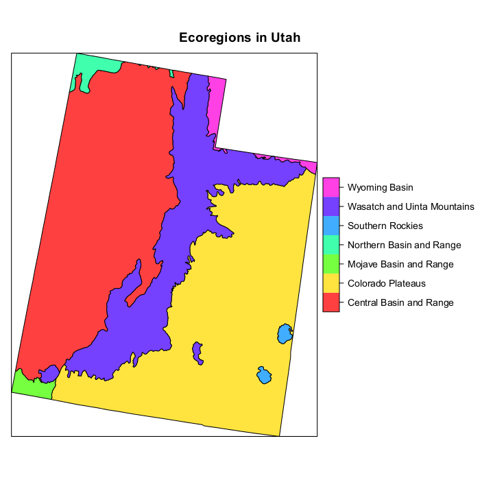

```{r setup, include = FALSE}
knitr::opts_chunk$set(
  collapse = TRUE,
  comment = "#>"
)
```

## Preliminaries
This document presents example GRTS survey designs for an area resource.  The area resource used in the designs is Omernik level 3 ecoregions within Utah.  Four survey designs will be presented: (1) an unstratified, equal probability design; (2) an unstratified, unequal probability design; (3) a stratified, equal probability design; and (4) an unstratified, unequal probability design with an oversample and a panel structure for survey over time.  The sampling frame used for the survey designs is contained in either an ESRI shapefile, an `sf` package object, or an `sp` package object.  The frame contains the coordinates for a set of polygons that define the area resource in addition to attribute data associated with the polygons.  The coordinate system for the set of points in the sampling frame is an equal area projection rather than latitude and longitude.  An equal area projection is used so that calculation of distance between points is valid.

The initial step is to use the library function to load the `spsurvey` package.  After the package is loaded, a message is printed to the R console indicating that the `spsurvey` package was loaded successfully.
 
Load the spsurvey package:
```{r load-spsurvey}
library(spsurvey)
library(sf)
library(sp)
```

## Read the sf object
For creating a survey design using the `spsurvey` package, the standard form of input regarding the resource is a simple features (`sf`) object.  An `sf` data set for creating the survey designs in this vignette is included in the data directory of the package.  The data function is used to load the data set stored in the data directory into an object named `UT_ecoregions`.  Note that `sf` objects loaded from the data sets in the data directory are stored in a format that is defined in the `sf` package.  See documentation for the `sf` package for additional information regarding format of those objects.

```{r UT-ecoregions}
data(UT_ecoregions)
```

## Attribute data
The ecoregion attribute will be used to define stratum codes and unequal selection probability (multidensity) categories for the survey designs.  Ecoregion is contained in a variable named "Level3_Nam" and includes seven unique values.  Frame area is summarized for the ecoregion attribute.  Note that ecoregion area measured in hectares is contained in the variable named "Area_ha".  The `tapply` function is used to calculate total area for each ecoregion.  The addmargins function is applied to the output from `tapply` to calculate total area for all ecoregions, and the round function is used to round value to whole numbers.  Finally, the resulting table is displayed.

Display the initial six features in the `sf` object:
```{r head-ecoregions}
head(UT_ecoregions)
```

Summarize frame area by ecoregion:
```{r summarize-ecoregions}
temp <- with(UT_ecoregions, tapply(Area_ha, Level3_Nam, sum))
temp <- round(addmargins(temp), 0)
temp
```

The seven ecoregions in Utah are displayed below.  Ecoregions are used during creation of several of the survey designs described in this vignette.



## Unstratified, equal probability, GRTS survey design
The first survey design is an unstratified, equal probability design.  The `set.seed` function is called so that, if necessary, the designs can be replicated.

The initial step is to create a list named `Equaldsgn` that contains information for specifying the survey design.  Since the survey design is unstratified, the list contains a single item named "None" that also is a list.  The "None" list includes two items: panel, which is used to specify the sample size for each panel, and seltype, which is used to input the type of random selection for the design.  For this example, panel is assigned a single value named "PanelOne" that is set equal to 115, and seltype is assigned the value "Equal", which indicates equal probability selection.

The `grts` function in the `spsurvey` package is called to select the survey design.  The following arguments are included in the call to `grts`: (1) design: the named list of stratum design specifications, which is assigned the Equaldsgn list; (2) DesignID: name for the design, which is used to create a site ID for each site and is assigned the value "EQUAL"; (3) type.frame: the type of frame, which is assigned the value "area" to indicate an area resource; (4) src.frame: source of the frame, which is assigned the value "sf.object" to indicate an sf object frame; (5) sf.object: the `sf` object, which is assigned the value UT_ecoregions;  and (6) shapefile: option to create a shapefile containing the survey design information, which is assigned FALSE.

During execution of the `grts` function, messages are printed that indicate the initial number of hierarchical levels used for the GRTS grid, the current number of levels, and the final number of levels.  The set of messages is printed for each stratum, and is labeled with the stratum name.  For this example, the set of messages is labeled "None", i.e., the name used in the Equaldsgn list.  Upon completion of the call to `grts`, the initial six sites for the survey design and a design summary are printed.  The output object created by the `grts` function is assigned class "SpatialDesign".  The design summary is created using the summary method for that class.  In addition to summary, a plot method is available for the `SpatialDesign` class.   For assistance using the `summary` and `plot` methods, see documentation for "SpatialDesign-class" on the R help page for `spsurvey`.

Call the `set.seed` function so that the design can be replicated:
```{r setseed}
set.seed(4447864)
```

Create the design list:
```{r equaldesign}
Equaldsgn <- list(None=list(panel=c(PanelOne=50), seltype="Equal"))
```

Select the sample:
```{r select_equalsites}
Equalsites <- grts(design=Equaldsgn,
                   DesignID="EQUAL",
                   type.frame="area",
                   src.frame="sf.object",
                   sf.object=UT_ecoregions,
                   maxlev = 5,
                   shapefile=FALSE)
```

Print the initial six lines of the survey design:
```{r head_design}
head(Equalsites)
```

Print the survey design summary:
```{r surveydesign_summary}
summary(Equalsites)
```

## Unstratified, unequal probability, GRTS survey design
The second survey design is an unstratified, unequal probability design.  Ecoregions are used to identify multidensity categories.  List `Unequaldsgn` is assigned design specifications.  Since the survey design is unstratified, `Unequaldsgn` includes a single list named "None" that contains three items: panel, seltype, and caty.n.  The value for panel is the same as for the equal probability design, and seltype is assigned "Unequal" to indicate unequal selection probabilities.  The third item, caty.n, assigns sample sizes for each of seven multidensity categories, where ecoregion names are used as the categories.  Note that the sum of sample sizes provided in caty.n must equal the value in panel.

For this survey design, a shapefile will be used as the sampling frame.  The `sf` package function `st_write` is used to create the shapefile.  The following arguments are included in the call to `grts`: (1) design: assigned the Unequaldsgn list; (2) DesignID: assigned the value "UNEQUAL"; (3) type.frame: assigned the value "area"; (4) src.frame: assigned the value "shapefile"; (5) in.shape: assigned the value "UT_ecoregions.shp"; (6) mdcaty: name of the column in the attributes data frame that identifies the unequal probability category for each element in the frame, which is assigned the value "level3_nam"; and (7) shapefile: assigned the value FALSE.  Upon completion of the call to `grts`, the initial six sites for the survey design and a design summary are printed.

```{r write_design}
st_write(UT_ecoregions, "UT_ecoregions.shp", quiet = TRUE, delete_dsn = TRUE)
```

Create the design list:
```{r design_list}
Unequaldsgn <- list(None=list(panel=c(PanelOne=50),
                              seltype="Unequal",
                              caty.n=c("Central Basin and Range"=10,
                                       "Colorado Plateaus"=10,
                                       "Mojave Basin and Range"=5,
                                       "Northern Basin and Range"=5,
                                       "Southern Rockies"=5,
                                       "Wasatch and Uinta Mountains"=10,
                                       "Wyoming Basin"=5)))
```

Select the sample:
```{r select_unequalsites}
Unequalsites <- grts(design=Unequaldsgn,
                     DesignID="UNEQUAL",
                     type.frame="area",
                     src.frame="shapefile",
                     in.shape="UT_ecoregions.shp",
                     mdcaty="Level3_Nam",	
                     maxlev = 3,
                     shapefile=FALSE)
```

Print the initial six lines of the survey design:
```{r head_unequalsites}
head(Unequalsites)
```

Print the survey design summary:
```{r summary_unequalsites}
summary(Unequalsites)
```

## Stratified, equal probability, GRTS survey design
The third survey design is a stratified, equal probability design.  Ecoregions are used to identify strata.  List `Stratdsgn` is assigned design specifications.  The ecoregion attribute is used to identify strata.  `Stratdsgn` includes seven lists, one for each stratum.  The names for the lists match the levels of the stratum variable, i.e., the unique values of the ecoregion attribute.  Each list in Stratdsgn contains two items: panel and seltype.  The value for panel is the same as for the equal probability design, and seltype is assigned "Equal".

For this survey design, an `sp` package object will be used as the sampling frame.  The `sf` package function as_Spatial is used to create an `sp` object named UT_ecoregions_sp.  The following arguments are included in the call to `grts`: (1) design: assigned the Stratdsgn list; (2) DesignID: assigned the value "STRATIFIED"; (3) type.frame: assigned the value "area"; (4) src.frame: assigned the value "sp.object" to indicate that the sampling frame is provided by an `sp` object; (5) sp.object: the `sp` object, which is assigned the UT_ecoregions_sp object; (6) stratum: name of the column in the attributes data frame that identifies the stratum code for each element in the frame, which is assigned the value "level3_nam"; and (7) shapefile: assigned the value FALSE.  Upon completion of the call to `grts`, the initial six sites for the survey design and a design summary are printed.

Create the sp object:
```{r create_spobject}
UT_ecoregions_sp <- sf::as_Spatial(UT_ecoregions)
proj4string(UT_ecoregions_sp) <- sp::CRS(st_crs(UT_ecoregions)$proj4string)@projargs
```

Create the design list:
```{r create_designlist}
Stratdsgn <- list("Central Basin and Range"=list(panel=c(PanelOne=10),
                                                 seltype="Equal"),
                  "Colorado Plateaus"=list(panel=c(PanelOne=10),
                                           seltype="Equal"),
                  "Mojave Basin and Range"=list(panel=c(PanelOne=5),
                                                seltype="Equal"),
                  "Northern Basin and Range"=list(panel=c(PanelOne=5),
                                                  seltype="Equal"),
                  "Southern Rockies"=list(panel=c(PanelOne=5),
                                          seltype="Equal"),
                  "Wasatch and Uinta Mountains"=list(panel=c(PanelOne=10),
                                                     seltype="Equal"),
                  "Wyoming Basin"=list(panel=c(PanelOne=5),
                                       seltype="Equal"))
```

Select the sample:
```{r select_strat_sample}
Stratsites <- grts(design=Stratdsgn,
                   DesignID="STRATIFIED",
                   type.frame="area",
                   src.frame="sp.object",
                   sp.object=UT_ecoregions_sp,
                   stratum="Level3_Nam",	
                   maxlev = 3,
                   shapefile=FALSE)
```

Print the initial six lines of the survey design:
```{r head_stratsites}
head(Stratsites)
```

Print the survey design summary:
```{r stratsites_summary}
summary(Stratsites)
```

## Unstratified, unequal probability, GRTS survey design with an oversample and a panel structure for survey over time
The fourth survey design is an unstratified, unequal probability design with an oversample and a panel structure for survey over time.  List `Paneldsgn` is assigned design specifications.  Since the survey design is unstratified, `Paneldsgn` includes a single list named "None" that contains four items: panel, seltype, caty.n, and over.  A vector identifying sample sizes for five panels is assigned to panel.  The value "Unequal" is assigned to seltype, which indicates unequal selection probabilities.  The third item, caty.n, assigns sample sizes for each of seven multidensity categories, where ecoregion names are used as the categories.  Note that the sum of sample sizes provided in caty.n must equal the sum of sample sizes in panel.  The value 100 is assigned to over, which specifies an oversample of 100 sites.  An oversample is replacement sites for the survey design.  The `grts` function attempts to distribute the oversample proportionately among sample sizes for the multidensity categories.  If the oversample proportion for one or more categories is not a whole number, a warning message is printed and the proportion is rounded to the next higher integer.  For this example, the oversample is not proportionate to the category sample sizes, and the warning message is printed by calling the warnings function.

For this survey design, an `sf` object will be used as the sampling frame.  The following arguments are included in the call to `grts`: (1) design: assigned the Paneldsgn list; (2) DesignID: assigned the value "UNEQUAL"; (3) type.frame: assigned the value "area"; (4) src.frame: assigned the value "sf.object"; (5) sf.object: the sf object, which is assigned the value UT_ecoregions; (6) mdcaty: assigned the value "level3_nam"; and (7) shapefile: assigned the value FALSE.  Upon completion of the call to `grts`, the initial six sites for the survey design and a design summary are printed.

Create the design list:
```{r create_paneldesign}
Paneldsgn <- list(None=list(panel=c(Year1=10, Year2=10, Year3=10,
                                    Year4=10, Year5=10),
                            seltype="Unequal",
                            caty.n=c("Central Basin and Range"=10,
                                     "Colorado Plateaus"=10,
                                     "Mojave Basin and Range"=5,
                                     "Northern Basin and Range"=5,
                                     "Southern Rockies"=5,
                                     "Wasatch and Uinta Mountains"=10,
                                     "Wyoming Basin"=5),
                            over=5))
```

Select the sample:
```{r select_panelsites}
Panelsites <- grts(design=Paneldsgn,
                   DesignID="UNEQUAL",
                   type.frame="area",
                   src.frame="sf.object",
                   sf.object=UT_ecoregions,
                   maxlev = 5,
                   mdcaty="Level3_Nam",									
                   shapefile=FALSE)
```

Print the warning message:
```{r warnings}
warnings()
```

Print the initial six lines of the survey design:
```{r head_panelsites}
head(Panelsites)
```

Print the survey design summary:
```{r summary_panelsites}
summary(Panelsites)
```