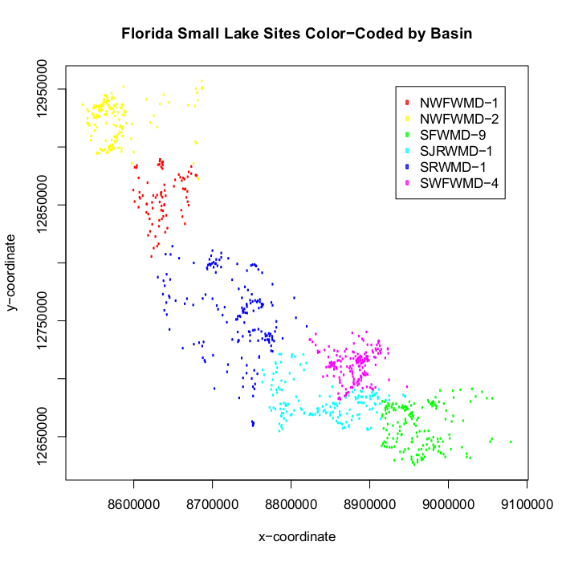

```{r setup, include = FALSE}
knitr::opts_chunk$set(
  collapse = TRUE,
  comment = "#>"
)
```

## Preliminaries
This document presents analysis of a GRTS survey design for a finite resource.  The finite resource used in the analysis is small lakes in Florida.  The analysis will include calculation of three types of population estimates: (1) estimation of proportion and size (number of lakes) for site evaluation status categorical variables; (2) estimation of proportion and size for lake condition categorical variables; and (3) estimation of the cumulative distribution function (CDF) and percentiles for quantitative variables.  Testing for difference between CDFs from subpopulations also will be presented.

The initial step is to use the `library` function to load the `spsurvey` package.  After the package is loaded, a message is printed to the R console indicating that the spsurvey package was loaded successfully.

Load the `spsurvey` package:
```{r load-spsurvey}
library(spsurvey)
```

## Load the survey design and analytical variables data set
The original Florida small lakes data file contains more than 3,800 records and 29 basins.  To produce a more manageable number of records, only six basins were retained in the data that will be analyzed, which produced a file containing 930 records.

The next step is to load the data set, which includes both survey design variables and analytical variables.  The data function is used to load the data set and assign it to a data frame named `FL_lakes`.  The `nrow` function is used to determine the number of rows in the `FL_lakes` data frame, and the resulting value is assigned to an object named `n`r. Finally, the initial six lines and the final six lines in the `FL_lakes` data frame are printed using the `head` and `tail` functions, respectively.

Load the survey design and analytical variables data set:
```{r load_FL_lakes}
data(FL_lakes)
nr <- nrow(FL_lakes)
```

Display the initial six lines in the data file:
```{r head_FL_lakes}
head(FL_lakes)
```

Display the final six lines in the data file:
```{r tail_FL_lakes}
tail(FL_lakes)
```

The sample of small lakes in Florida is displayed in the figure below.  The sample sites for each basin are displayed using a unique color.



## Analysis of site status evaluation variables
The first analysis that will be examined is calculation of extent estimates for site status evaluation variables.  Extent is measured both by the proportion of the resource in status evaluation categories and by size of the resource in each category.  For a finite resource like lakes, size refers to the number of lakes in a category.  For calculating extent estimates (and for all of the analyses we will consider), the survey design weights are incorporated into the calculation process.  Weights used in the analyses were modified from the original survey design weights to ensure that the weights sum to the known size of the resource.  Further information regarding weight adjustment is provided in the help page for the `adjwgt` (weight adjustment) function.  Two site status variables will be examined: (1) status, which classifies lakes into six evaluation categories and (2) TNT, which classifies lakes as either "Target" or "NonTarget".  The `table` and `addmargins` functions are used to create tables displaying the count for each code (level) of the two status variables.
```{r table_status}
cat("\nA table displaying the number of values for each level of the status
variable follows:\n")
addmargins(table(FL_lakes$Status))
```

```{r table_tnt}
cat("\nA table displaying the number of values for each level of the TNT
variable follows:\n")
addmargins(table(FL_lakes$TNT))
```

The `cat.analysis` function in the `spsurvey` package will be used to calculate extent estimates.  Four data frames constitute the primary input to the `cat.analysis` function.  The first column (variable) in the four data frames provides the unique identifier (site ID) for each sample site and is used to connect records among the data frames.  The siteID variable in the `FL_lakes` data frame is assigned to the siteID variable in the data frames.  The four data frames that will be created are named as follows: `sites`, `subpop`, `design`, and `data.cat`.  The `sites` data frame identifies sites to use in the analysis and contains two variables: (1) siteID - site ID values and (2) Use - a logical vector indicating which sites to use in the analysis.  The `rep` (repeat) function is used to assign the value TRUE to each element of the Use variable.  Recall that `nr` is an object containing the number of rows in the `FL_lakes` data frame.  The `subpop` data frame defines populations and, optionally, subpopulations for which estimates are desired.  Unlike the `sites` and `design` data frames, the `subpop` data frame can contain an arbitrary number of columns.  The first variable in the `subpop` data frame identifies site ID values and each subsequent variable identifies a type of population, where the variable name is used to identify type.  A type variable identifies each site with a character value.  If the number of unique values for a type variable is greater than one, then the set of values represent subpopulations of that type.  When a type variable consists of a single unique value, then the type does not contain subpopulations.  For this analysis, the `subpop` data frame contains three variables: (1) siteID - site ID values, (2) CombinedBasins - which will be used to calculate estimates for all of the basins combined, and (3) Basin - which will be used to calculate estimates for each basin individually.  The basin variable in the `FL_lakes` data frame is assigned to the Basin variable in the subpop data frame.  The design data frame consists of survey design variables.  For the analysis under consideration, the `design` data frame contains the following variables: (1) siteID - site ID values; (2) wgt - final, adjusted, survey design weights; (3) xcoord - x-coordinates for location; and (4) ycoord - y-coordinates for location.  The wgt, xcoord, and ycoord variables in the `design` data frame are assigned values using variables with the same names in the `FL_lakes` data frame.  Like the `subpop` data frame, the `data.cat` data frame can contain an arbitrary number of columns.  The first variable in the `data.cat` data frame identifies site ID values and each subsequent variable identifies a response variable. The two response variables are Status and Target_NonTarget, which are assigned the status and TNT variables, respectively, in the `FL_lakes` data frame. Missing data (NA) is allowed for the response variables, which are the only variables in the input data frames for which NA values are allowed.

Create the `sites` data frame, which identifies sites to use in the analysis. Note that all sites will be used to estimate number of lakes in each category:
```{r create_sites}
sites <- data.frame(siteID=FL_lakes$siteID,
                    Use=rep(TRUE, nr))
```

Create the `subpop` data frame, which defines populations and subpopulations for which estimates are desired:
```{r create_subpop}
subpop <- data.frame(siteID=FL_lakes$siteID,
                     CombinedBasins=rep("All Basins", nr), 
							       Basin=FL_lakes$Basin)
```

Create the `design` data frame, which identifies the stratum code, weight, x-coordinate, and y-coordinate for each site ID:
```{r create_design}
design <- data.frame(siteID=FL_lakes$siteID,
                     wgt=FL_lakes$wgt,
                     xcoord=FL_lakes$xcoord,
                     ycoord=FL_lakes$ycoord)
```

Create the `data.cat` data frame, which specifies the variables to use in the analysis:
```{r create_data.cat}
data.cat <- data.frame(siteID=FL_lakes$siteID,
                       Status=FL_lakes$Status,
                       Target_NonTarget=FL_lakes$TNT)
```

Use the `cat.analysis` function to calculate extent estimates for the site status evaluation variables:
```{r extent_est}
# Calculate extent estimates for the site status evaluation variables
Extent_Estimates <- cat.analysis(sites, subpop, design, data.cat)
```

The extent estimates for all basins combined are displayed using the `print` function.  The object produced by `cat.analysis` is a data frame containing thirteen columns.  The first five columns identify the population (Type), subpopulation (Subpopulation), response variable (Indicator), levels of the response variable (Category), and number of values in a category (NResp).  A category labeled "Total" is included for each combination of population, subpopulation, and response variable.  The next four columns in the data frame provide results for the proportion (percent scale) estimates: the proportion estimate (Estimate.P), standard error of the estimate (StdError.P), lower confidence bound (LCB95Pct.P), and upper confidence bound (UCB95Pct.P).  Argument conf for `cat.analysis` allows control of the confidence bound level.  The default value for conf is 95, hence the column names for confidence bounds contain the value 95.  Supplying a different value to the conf argument will be reflected in the confidence bound names.  Confidence bounds are obtained using the standard error and the Normal distribution multiplier corresponding to the confidence level.  The final four columns in the data frame provide results for the size (units scale) estimates: the size estimate (Estimate.U), standard error of the estimate (StdError.U), lower confidence bound (LCB95Pct.U), and upper confidence bound (UCB95Pct.U).  Note that the size estimate for the Total category will be equal to the sum of the survey design weights.

Print the extent estimates for all basins combined:
```{r print_ext}
print(Extent_Estimates[c(1:7, 45:47),])
```

The `write.csv` function is used to store the extent estimates as a comma-separated value (csv) file.  Files in csv format can be read by programs such as Microsoft Excel.

Write results as a comma-separated value (csv) file:
```{r write_ext}
write.csv(Extent_Estimates, file="Extent_Estimates.csv", row.names=FALSE)
```

## Analysis of lake condition variables
The second analysis that will be examined is estimating resource proportion and size for lake condition variables.  Two lake condition variables will be examined: (1) pH_cat, which classifies lakes by categories of pH value and (2) coliform_cat, which classifies lakes by categories of fecal coliform count.  The `table` and `addmargins` functions are used to create tables displaying the count for each level of the two lake condition variables.

Use the table and addmargins functions to create a table displaying the count for each code of the pH category variable:
```{r table_phcat}
cat("\nA table displaying the number of values for each level of the pH category
variable follows:\n")
addmargins(table(FL_lakes$pH_Cat))
```

Use the table and addmargins functions to create a table displaying the count for each code of the fecal coliform category variable:
```{r table_colcat}
cat("\nA table displaying the number of values for each level of the fecal
coliform category variable follows:\n")
addmargins(table(FL_lakes$Coliform_Cat))
```

As for extent estimates, the `cat.analysis` function will be used to calculate condition estimates.  The `sites` data frame for this analysis differs from the one used to calculate extent estimates.  The Use logical variables in `sites` is set equal to the value "Sampled", so that only sampled sites are used in the analysis. The `subpop` and `design` data frames created in the prior analysis can be reused for this analysis.  The `data.cat` data frame contains the two lake condition variables: pHCat and ColiformCat.  Variables pH_cat and coliform_cat in the `FL_lakes` data frame are assigned to pHCat and ColiformCat, respectively.
  
Create the `sites` data frame:
```{r create_sites2}
# Conduct an analysis of lake condition variables
# Create the sites data frame
# Note that only sampled sites are used
sites <- data.frame(siteID=FL_lakes$siteID,
                    Use=FL_lakes$Status == "Sampled")
# Note that the existing subpop and design data frames can be reused
```

Create the `data.cat data` frame, which specifies the variables to use in the analysis:
```{r create_data.cat2}
data.cat <- data.frame(siteID=FL_lakes$siteID,
                       pHCat=FL_lakes$pH_Cat,
                       ColiformCat=FL_lakes$Coliform_Cat)
```

Use the `cat.analysis` function to calculate estimates for the lake condition variables:
```{r cond_ests2}
# Calculate estimates for the categorical variables
Condition_Estimates <- cat.analysis(sites, subpop, design, data.cat)
```

Print the condition estimates for all basins combined:
```{r print_all_cond}
print(Condition_Estimates[c(1:4, 28:32),])
```

Use the `write.csv` function to write the condition estimates as a csv file:
```{r write_cond_ests}
write.csv(Condition_Estimates, file="Condition_Estimates.csv", row.names=FALSE)
```

## Analysis of lake condition variables correcting for population size
The frame is a data structure containing spatial location data in addition to other attributes regarding a resource of interest and is used to create a survey design.  A frame often takes the form of a shapefile.  The frame can be used to obtain size values (e.g., number of lakes) for the populations and subpopulations examined in an analysis.  Examination of the Estimates.U column in the `Condition_Estimates` data frame produced by `cat.analysis` reveals that the estimated Total value for both condition variables and each combination of population value and subpopulation value does not sum to the corresponding frame size value.  For example, the Total entry in the Estimate.U column for the pHcat variable, population "CombinedBasins" and subpopulation "All Basins" is 935 (rounded to a whole number).  This value is an estimate of the size of the sampled resource.  The corresponding frame size value is 5,146.  The popsize (population size) argument to `cat.analysis` provides a mechanism for forcing the size estimates to sum to a desired value, e.g., the frame size value.  Note that including popsize as an argument results in assigning the popsize value to the Total category of the size estimates.  Use of the popsize argument assumes that sites which were evaluated but not sampled were missing at random.  The missing at random asumption may not be a valid assumption, e.g., sites for which access was denied by the landowner may not be the same as sites that were sampled.  For the current analysis, we will assume that the assumption is valid.  As a first step for use of the popsize argument, the `combine` function is used to create a named vector of frame size values for each basin. Output from the `combine` function is assigned to an object named `framesize`.  The `popsize` argument is a list, which is a particular type of R object.  The `popsize` list must include an entry for each population type included in the `subpop` data frame, i.e., CombinedBasins and Basin for this analysis.  The `sum` function applied to `framesize` is assigned to the CombinedBasins entry in the `popsize` list.  Recall that the basin population type contains subpopulations, i.e., basins.  When a population type contains subpopulations, the entry in the `popsize` list also is a list.  The `as.list` function is applied to `framesize`, and the result is assigned to the Basin entry in the `popsize` list.

Conduct an analysis of lake condition variables correcting for population size. Note that the existing sites, subpop, design, and data.cont data frames can be reused. Assign frame size values:
```{r framesize}
framesize <- c("NWFWMD-1"=451, "NWFWMD-2"=394, "SFWMD-9"=834, "SJRWMD-1"=1216,
               "SRWMD-1"=1400, "SWFWMD-4"=851)
```

Use the `cat.analysis` function to calculate estimates for the lake condition variables:
```{r lake_cond_ests}
Condition_Estimates_popsize <- cat.analysis(sites, subpop, design, data.cat,
   popsize=list(CombinedBasins=sum(framesize),
                Basin=as.list(framesize)))
```

Print the lake condition estimates for all basins combined:
```{r print_lake_cond_ests}
print(Condition_Estimates_popsize[c(1:4, 28:32),])
```

Use the `write.csv` function to write the condition estimates as a csv file:
```{r write_lake_cond_ests}
write.csv(Condition_Estimates_popsize, file="Condition_Estimates_popsize.csv",
   row.names=FALSE)
```

## Analysis of quantitative variables
The third analysis that will be examined is estimating the CDF and percentiles for quantitative variables.  Two quantitative variables will be examined: (1) oxygen - dissolved oxygen value and (2) turbidity - turbidity value.  The summary function is used to summarize the data structure of the two quantitative variables.

Use the summary function to summarize the data structure of the dissolved oxygen variable:
```{r summary_do}
cat("\nSummarize the data structure of the dissolved oxygen variable:\n")
summary(FL_lakes$Oxygen)
```

Use the summary function to summarize the data structure of the turbidity variable:
```{r summary_turb}
cat("\nSummarize the data structure of the turbidity variable:\n")
summary(FL_lakes$Turbidity)
```

The `cont.analysis` function will be used to calculate estimates for quantitative variables.  Input to the `cont.analysis` function is the same as input for the `cat.analysis` function except that the data frame containing response variables is named `cont.data` rather than `cat.data`.  The `sites`, `subpop`, and `design` data frames created in the analysis of lake condition variables can be reused for this analysis.  The `data.cont` data frame contains the two quantitative variables: DissolvedOxygen and Turbidity.  Variables oxygen and turbidity in the `FL_lakes` data frame are assigned to DissolvedOxygen and Turbidity, respectively.  The popsize argument is included in the call to `cont.analysis`.
  
Conduct an analysis of quantitative variables. Note that the existing `sites`, `subpop`, and `design` data frames can be reused. Create the `data.cont data` frame, which specifies the variables to use in the analysis:
```{r create_data.cont2}
data.cont <- data.frame(siteID=FL_lakes$siteID,
                        DissolvedOxygen=FL_lakes$Oxygen,
                        Turbidity=FL_lakes$Turbidity)
```

Use the `cont.analysis` function to calculate CDF and percentile estimates for the quantitative variables:
```{r cdf_ests2}
CDF_Estimates <- cont.analysis(sites, subpop, design, data.cont,
   popsize=list(CombinedBasins=sum(framesize),
                Basin=as.list(framesize)))
```

The object produced by `cont.analysis` is a list containing two objects: (1) `CDF`, a data frame containing the CDF estimates and (2) `Pct`, a data frame containing percentile estimates plus estimates of population values for mean, variance, and standard deviation.  Format for the `CDF` data frame is analogous to the data frame produced by `cat.analysis`.  For the `CDF` data frame, however, the fourth column is labeled Value and contains the value at which the CDF was evaluated.  Unlike the data frames produced by the other analysis functions we have examined, the `Pct` data frame contains only nine columns since there is a single set of estimates rather than two sets of estimates.  In addition, the fourth column is labeled Statistic and identifies either a percentile or the mean, variance, or standard deviation.  Finally, since percentile estimates are obtained by inverting the CDF estimate, the percentile estimates do not have a standard error value associated with them.

Use the `write.csv` function to write the CDF estimates as a csv file:
```{r write_cdf_ests2}
write.csv(CDF_Estimates$CDF, file="CDF_Estimates.csv", row.names=FALSE)
```

The `cont.cdfplot` function in `spsurvey` can be used to produce a PDF file containing plots of the CDF estimates.  The primary arguments to `cont.cdfplot` are a character string containing a name for the PDF file and the `CDF` data frame in the `CDF_Estimates` object.  In addition, we make use of the logx argument to `cont.cdfplot`, which controls whether the CDF estimate is displayed using a logarithmic scale for the x-axis.  The logx argument accepts two values: (1) "", do not use a logarithmic scale and (2) "x" - use a logarithmic scale.  For this analysis, dissolved oxygen is displayed using the original response scale and turbidity is displayed using a logarithmic scale.

Produce a PDF file containing plots of the CDF estimates:
```{r cdfplot}
cont.cdfplot("CDF_Estimates.pdf", CDF_Estimates$CDF, logx=c("","x"))
```

Print the percentile estimates for dissolved oxygen for all basins combined:
```{r print_cdf}
print(CDF_Estimates$Pct[1:10,])
```

Use the `write.csv` function to write the percentile estimates as a csv file:
```{r write_cdf}
write.csv(CDF_Estimates$Pct, file="Percentile_Estimates.csv")
```

The `cont.cdftest` function in `spsurvey` can be used to test for statistical difference between the CDFs from subpopulations.  For this analysis we will test for statistical difference between the CDFs from the six basins.  The `cont.cdftest` function will test all possible pairs of basins.  Arguments to `cont.cdftest` are the same as arguments to `cont.analysis`. Since we are interested only in testing among basins, the `subpop` data frame is subsetted to include only the siteID and Basin variables.  Note that the popsize argument was modified from prior examples to include only the entry for Basin.

Test for statistical difference between CDFs for basins:
```{r cdf_tests}
CDF_Tests <- cont.cdftest(sites, subpop[,c(1,3)], design, data.cont,
   popsize=list(Basin=as.list(framesize)))
```

The `print` function is used to display results for dissolved oxygen of the statistical tests for difference between CDFs for basins.  The object produced by `cont.cdftest` is a data frame containing eight columns. The first column (Type) identifies the population.  The second and third columns (Subpopulation_1 and Subpopulation_2) identify the subpopulations.  The fourth column (Indicator) identifies the response variable.  Column five contains values of the test statistic.  Six test statistics are available, and the default statistic is an F-distribution version of the Wald statistic, which is identified in the data frame as "Wald-F".  The default statistic is used in this analysis.  For further information about the test statistics see the help file for the `cdf.test` function in `spsurvey`, which includes a reference for the test for differences in CDFs.  Columns six and seven (Degrees_of_Freedom_1 and Degrees_of_Freedom_2) provide the numerator and denominator degrees of freedom for the Wald test.  The final column (p_Value) provides the p-value for the test.
```{r cdf_tests_print}
print(CDF_Tests, digits=3)
```

Use the `write.csv` function to write CDF test results as a csv file:
```{r cdf_tests_write}
write.csv(CDF_Tests, file="CDF_Tests.csv", row.names=FALSE)
```