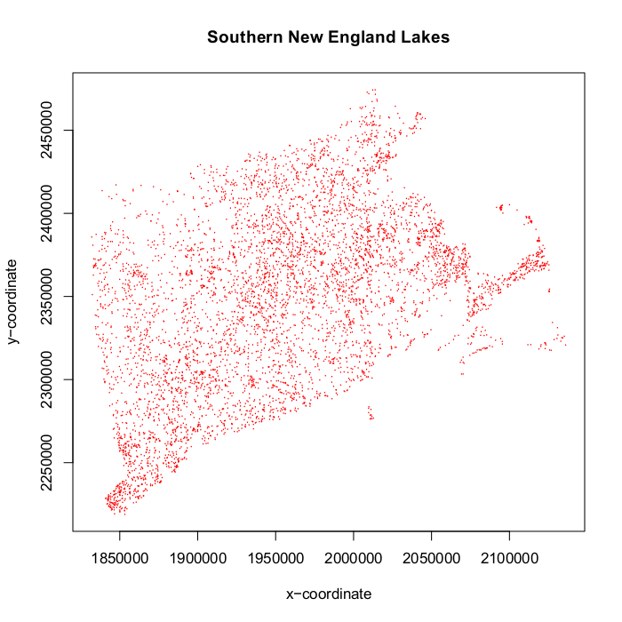

```{r setup, include = FALSE}
knitr::opts_chunk$set(
  collapse = TRUE,
  comment = "#>"
)
```

## Preliminaries
This document presents example GRTS survey designs for a finite resource.  The finite resource used in the designs is lakes in the southern New England region of the U.S.  Four survey designs will be presented: (1) an unstratified, equal probability design; (2) a stratified, equal probability design; (3) an unstratified, unequal probability design with an oversample; and (4) an unstratified, unequal probability design with an oversample and a panel structure for survey over time.  The sampling frame used for the survey designs is contained in either an ESRI shapefile, a data frame, an `sf` package object or an `sp` package object.  The frame contains the coordinates for a set of points that define the finite resource in addition to attribute data associated with the points.  The coordinate system for the set of points in the sampling frame is an equal area projection rather than latitude and longitude.  An equal area projection is used so that calculation of distance between points is valid.  Use of the three sources for the sampling frame will be illustrated in the example survey designs.

The initial step is to use the `library` function to load the `spsurvey` package.  After the package is loaded, a message is printed to the R console indicating that the `spsurvey` package was loaded successfully.

Load the `spsurvey` package:
```{r load-spsurvey}
library(spsurvey)
```

## Read the `sf` object
For creating a survey design using the `spsurvey` package, the standard form of input regarding the resource is a simple features (`sf`) object.  An `sf` data set for creating the survey designs in this vignette is included in the data directory of the package.  The `data` function is used to load the data set stored in the data directory into an object named `NE_lakes`.  Note that `sf` objects loaded from the data sets in the data directory are stored in a format that is defined in the `sf` package.  See documentation for the `sf` package for additional information regarding format of those objects.

Load the `sf` object in the data directory:
```{r load_NElakes}
data(NE_lakes)
```

## Attribute data
Two attributes, state name and lake area category, that will be used to define, respectively, stratum codes and unequal selection probability (multidensity) categories for the survey designs are examined.  State name is contained in a variable named "state", and lake area category is contained in a variable named "area_cat".  For lake area category, lakes are classified by surface area measured in hectares.  The lake area categories are coded using values such as "(5,10]", which indicates that lake area is greater than five hectares but less than or equal to ten hectares.  The `table` and `addmargin` functions are used to produce a table displaying number of lakes for each combination of values for the strata and multidensity category variables.

Display the initial six features in the `sf` object:
```{r head_NElakes}
head(NE_lakes)
```

Display number of lakes cross-classified by strata and multidensity category:
```{r cross-class_NElakes}
with(NE_lakes, addmargins(table("State"=State, "Lake Area Category"=Area_Cat)))
```

Lakes in the southern New England region are displayed in the figure below:



## Unstratified, equal probability, GRTS survey design
The first survey design is an unstratified, equal probability design.  The `set.seed` function is called so that, if necessary, the designs can be replicated.

The initial step is to create a list named `Equaldsgn` that contains information for specifying the survey design.  Since the survey design is unstratified, the list contains a single item named "None" that also is a list.  The "None" list includes two items: panel, which is used to specify the sample size for each panel, and seltype, which is used to input the type of random selection for the design.  For this example, panel is assigned a single value named "PanelOne" that is set equal to 300, and seltype is assigned the value "Equal", which indicates equal probability selection.

The `grts` function in the `spsurvey` package is called to select the survey design.  The following arguments are included in the call to `grts`: (1) design: the named list of stratum design specifications, which is assigned the Equaldsgn list; (2) DesignID: name for the design, which is used to create a site ID for each site and is assigned the value "EQUAL"; (3) type.frame: the type of frame, which is assigned the value "finite" to indicate a finite resource; (4) src.frame: source of the frame, which is assigned the value "sf.object" to indicate an sf object frame; (5) sf.object: the `sf` object, which is assigned the value `NE_lakes`; and (6) shapefile: option to create a shapefile containing the survey design information, which is assigned FALSE.

During execution of the `grts` function, messages are printed that indicate the initial number of hierarchical levels used for the GRTS grid, the current number of levels, and the final number of levels.  The set of messages is printed for each stratum, and is labeled with the stratum name.  For this example, the set of messages is labeled "None", i.e., the name used in the Equaldsgn list.  Upon completion of the call to `grts`, the initial six sites for the survey design and a design summary are printed.  The output object created by the `grts` function is assigned class "SpatialDesign".  The design summary is created using the summary method for that class.  In addition to summary, a plot method is available for the SpatialDesign class.   For assistance using the summary and plot methods, see documentation for "SpatialDesign-class" on the R help page for `spsurvey`.

Call the `set.seed` function so that the design can be replicated:
```{r set.seed}
set.seed(4447864)
```

Create the design list:
```{r design.list}
Equaldsgn <- list(None=list(panel=c(PanelOne=100), seltype="Equal"))
```

Select the sample:
```{r select.sample}
Equalsites <- grts(design=Equaldsgn,
                   DesignID="EQUAL",
                   type.frame="finite",
                   src.frame="sf.object",
                   sf.object=NE_lakes,
                   shapefile=FALSE)
```

Print the initial six lines of the survey design:
```{r head.design}
head(Equalsites)
```

Print the survey design summary:
```{r summary.design}
summary(Equalsites)
```

## Stratified, equal probability, GRTS survey design
The second survey design is a stratified, equal probability design.  The state attribute is used to identify strata.  List `Stratdsgn` is assigned design specifications.  `Stratdsgn` includes six lists, one for each stratum.  The names for the lists match the levels of the stratum variable, i.e., the unique values of the state attribute.  Each list in Stratdsgn contains two items: panel and seltype.  The value for panel is the same as the equal probability design (50), and seltype is assigned "Equal".

For this survey design, a data frame will be used as the sampling frame.  A data frame named `NE_lakes_df` is creaated by dropping the geometry column from the `NE_lakes` object.  Note that the `NE_lakes` object includes spatial coordinates among its attributes.  The following arguments are included in the call to `grts`: (1) design: assigned the Stratdsgn list; (2) DesignID: assigned the value "STRATIFIED"; (3) type.frame: assigned the value "finite"; (4) src.frame: assigned the value "att.frame" to indicate that the sampling frame is provided by argument att.frame; (5) att.frame: assigned the `E_lakes_df` data frame; (6) xcoord: name of the column in the attributes data frame that identifies x-coordinates, which is assigned the value "xcoord";  (7) ycoord: name of the column in the `attributes` data frame that identifies y-coordinates, which is assigned the value "ycoord";  (8) stratum: name of the column in the `attributes` data frame that identifies the stratum code for each element in the frame, which is assigned the value "State"; and (9) shapefile: assigned the value FALSE.  Upon completion of the call to `grts`, the initial six sites for the survey design and a design summary are printed.

Create the data frame:
```{r create_df}
geom_name <- attr(NE_lakes, "sf_column")
NE_lakes_df <- subset(NE_lakes, select=names(NE_lakes) != geom_name, drop = TRUE)
```

Create the design list:
```{r create_designlist}
Stratdsgn <- list(CT=list(panel=c(PanelOne=40), seltype="Equal"),
                  MA=list(panel=c(PanelOne=40), seltype="Equal"),
                  RI=list(panel=c(PanelOne=20), seltype="Equal"))
```

Select the sample:
```{r select.sample2}
Stratsites <- grts(design=Stratdsgn,
                   DesignID="STRATIFIED",
                   type.frame="finite",
                   src.frame="att.frame",
                   att.frame=NE_lakes_df,
                   xcoord="xcoord",
                   ycoord="ycoord",
                   stratum="State",
                   shapefile=FALSE)
```

Print the initial six lines of the survey design:
```{r head.stratsites}
head(Stratsites)
```

Print the survey design summary:
```{r summary.stratsites}
summary(Stratsites)
```

## Unstratified, unequal probability, GRTS survey design with an oversample
The third survey design is an unstratified, unequal probability design with an oversample.  Lake area classes are used to identify multidensity categories.  List `Unequaldsgn` is assigned design specifications.  Since the survey design is unstratified, `Unequaldsgn` includes a single list named "None" that contains four items: panel, seltype, caty.n, and over.  The value for panel is the same as the equal probability design, and seltype is assigned "Unequal" to indicate unequal selection probabilities.  The third item, caty.n, assigns sample sizes for each of the six multidensity categories.  Note that the sum of sample sizes provided in caty.n must equal the value in panel.  The fourth item, over, is assigned the value 120, which specifies an oversample of 120 sites.  An oversample is replacement sites for the survey design.  The `grts` function attempts to distribute the oversample proportionately among sample sizes for the multidensity categories.  If the oversample proportion for one or more categories is not a whole number, a warning message is printed and the proportion is rounded to the next higher integer.  For this example, the oversample is proportionate to the category sample sizes, and the warning message is not printed.

For this survey design, an `sp` package object will be used as the sampling frame.  The `sf` package function `as_Spatial` is used to create an `sp` object named `NE_lakes_sp`.  The following arguments are included in the call to `grts`: (1) design: assigned the Unequaldsgn list; (2) DesignID: assigned the value "UNEQUAL"; (3) type.frame: assigned the value "finite"; (4) src.frame: assigned the value "sp.object" to indicate that the sampling frame is provided by an sp object; (5) sp.object: the sp object, which is assigned the `NE_lakes_sp` object; (6) mdcaty: name of the column in the `attributes` data frame that identifies the unequal probability category for each element in the frame, which is assigned the value "Area_cat"; and (7) shapefile: assigned the value FALSE.  Upon completion of the call to `grts`, the initial six sites for the survey design and a design summary are printed.

Create the `sp` object:
```{r create_sp}
NE_lakes_sp <- as_Spatial(NE_lakes)
```

Create the design list:
```{r create_design_list}
Unequaldsgn <- list(None=list(panel=c(PanelOne=90),
                              seltype="Unequal",
                              caty.n=c("(0,1]"=15, "(1,5]"=30, "(5,10]"=15,
                                       "(10,50]"=15, "(50,500]"=10,
                                       "(500,1e+04]"=5),
                              over=10))
```

Select the sample:
```{r select_sample}
Unequalsites <- grts(design=Unequaldsgn,
                     DesignID="UNEQUAL",
                     type.frame="finite",
                     src.frame="sp.object",
                     sp.object=NE_lakes_sp,
                     mdcaty="Area_Cat",
                     shapefile=FALSE)
```

Print the initial six lines of the survey design:
```{r head_design}
head(Unequalsites)
```

Print the survey design summary:
```{r summary_design}
summary(Unequalsites)
```

## Unstratified, unequal probability, GRTS survey design with an oversample and a panel structure for survey over time
The fourth survey design is an unstratified, unequal probability design with an oversample and a panel structure for survey over time.  List `Paneldsgn` is assigned design specifications.  Since the survey design is unstratified, `Paneldsgn` includes a single list named "None" that contains four items: panel, seltype, caty.n, and over.  A vector identifying sample sizes for five panels is assigned to panel.  The value "Unequal" is assigned to seltype, which indicates unequal selection probabilities.  The third item, caty.n, assigns sample sizes for each of six multidensity categories, where lake area classes are used as the categories.  The value 100 is assigned to over, which specifies an oversample of 100 sites.  For this example, the oversample is not proportionate to the category sample sizes, and the warning message is printed by calling the `warnings` function.

For this survey design, a shapefile will be used as the sampling frame.  The `sf` package function `st_write` is used to create the shapefile.  The following arguments are included in the call to `grts`: (1) design: assigned the Paneldsgn list; (2) DesignID: assigned the value "UNEQUAL"; (3) type.frame: assigned the value "finite"; (4) src.frame: assigned the value "shapefile"; (5) in.shape: assigned the value "NE_lakes.shp"; (6) mdcaty: assigned the value "Area_cat"; and (7) shapefile: assigned the value FALSE.  Upon completion of the call to `grts`, the initial six sites for the survey design and a design summary are printed.

Create the shapefile:
```{r create_shapefile}
st_write(NE_lakes, "NE_lakes.shp", quiet = TRUE, delete_dsn = TRUE)
```

Create the design list:
```{r create_design2}
Paneldsgn <- list(None=list(panel=c(Annual=15, Year1=15, Year2=15, Year3=15,
                                    Year4=15, Year5=15),
                            seltype="Unequal",
                            caty.n=c("(0,1]"=15, "(1,5]"=30, "(5,10]"=15,
                                     "(10,50]"=15, "(50,500]"=10,
                                     "(500,1e+04]"=5),
                            over=10))
```

Select the sample:
```{r select_sample2}
Panelsites <- grts(design=Paneldsgn,
                   DesignID="UNEQUAL",
                   type.frame="finite",
                   src.frame="shapefile",
                   in.shape="NE_lakes.shp",
                   mdcaty="Area_Cat",
                   shapefile=FALSE)
```

Print the warning message:
```{r warnings}
warnings()
```

Print the initial six lines of the survey design:
```{r head_design2}
head(Panelsites)
```

Print the survey design summary
```{r summary_design2}
summary(Panelsites)
```

