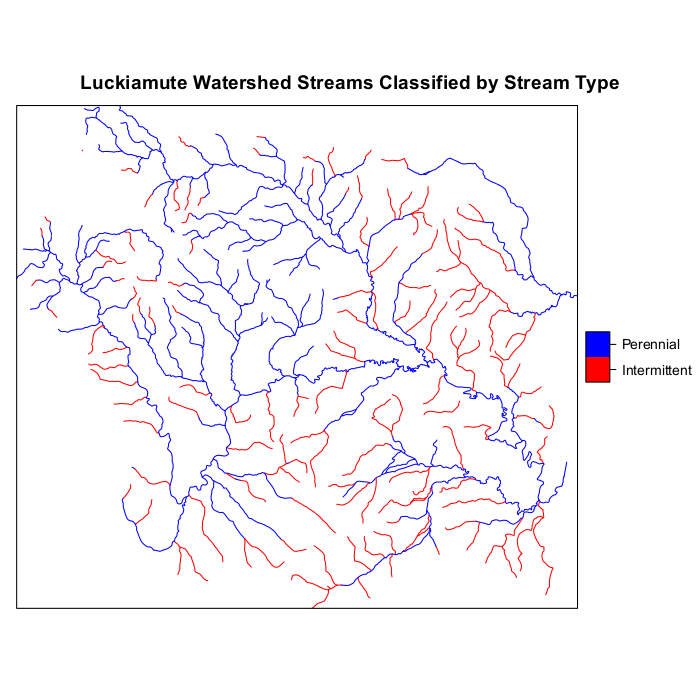
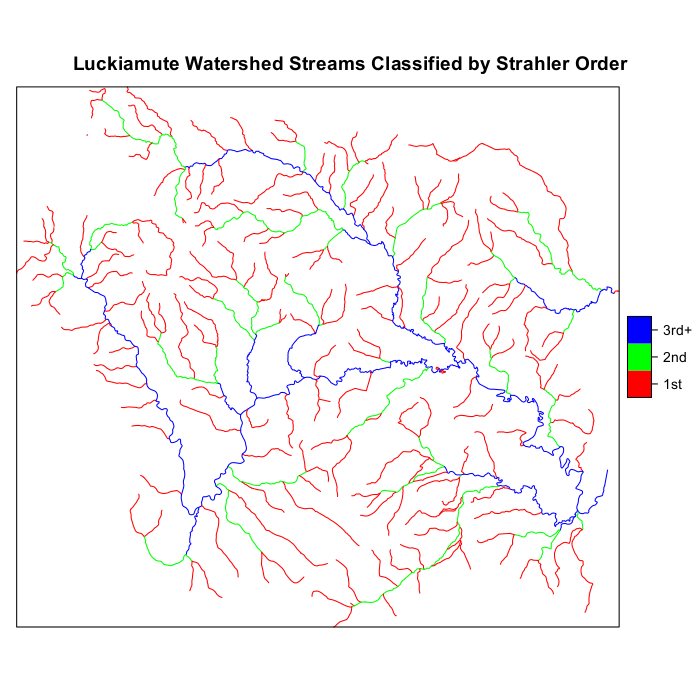

```{r setup, include = FALSE}
knitr::opts_chunk$set(
  collapse = TRUE,
  comment = "#>"
)
```

## Preliminaries
This document presents example GRTS survey designs for a linear resource.  The linear resource used in the designs is streams that comprise the Luckiamute watershed in Oregon.  Four survey designs will be presented: (1) an unstratified, equal probability design; (2) a stratified, equal probability design with an oversample; (3) a stratified, unequal probability design with an oversample; and (4) a stratified, unequal probability design with an oversample and a panel structure for survey over time.  The sampling frame used for the survey designs is contained in either an ESRI shapefile, an `sf` object, or an `sp` package object.  The frame contains the coordinates for a set of line segments that define the linear resource in addition to attribute data associated with the line segments.  The coordinate system for the set of points in the sampling frame is an equal area projection rather than latitude and longitude.  An equal area projection is used so that calculation of distance between points is valid.

The initial step is to use the `library` function to load the `spsurvey` package.  After the package is loaded, a message is printed to the R console indicating that the `spsurvey` package was loaded successfully.

Load the `spsurvey` package:
```{r load-spsurvey}
library(spsurvey)
library(sf)
library(sp)
```

## Read the sf object
For creating a survey design using the `spsurvey` package, the standard form of input regarding the resource is a simple features (`sf`) object.  An `sf` data set for creating the survey designs in this vignette is included in the data directory of the package.  The `data` function is used to load the data set stored in the data directory into an object named `Luck_Ash_streams`.  Note that `sf` objects loaded from the data sets in the data directory are stored in a format that is defined in the `sf` package.  See documentation for the `sf` package for additional information regarding format of those objects.

Load the `sf` object in the data directory:
```{r load_luckash}
data(Luck_Ash_streams)
```

## Attribute data
Two attributes, stream type and Strahler stream order, will be used to define, respectively, stratum codes and unequal selection probability (multidensity) categories for the survey designs.  Stream type is contained in a variable named "Per_Int", and Strahler stream order is contained in a variable named "Strah_Cat".  For stream type, streams are classified as either perennial or intermittent.  For Strahler stream order, streams are classified as either first order ("1st"), second order ("2nd"), or third order and higher ("3rd+").  The `table` and `addmargin` functions are used to produce a table displaying number of stream segments for each combination of values for the strata and multidensity category variables.

Finally, frame stream length is summarized for the strata and multidensity category attributes.  Note that stream length measured in kilometers is contained in the variable named "Length_km".  The `tapply` function is used to calculate total stream length for each combination of stream type and Strahler stream order.  The `addmargins` function is applied to the output from `tapply` to calculate stream length for each category of stream type and Strahler stream order, and the round function is used to round value to two decimal places.  Finally, the resulting cross-tabulation of sum of stream length in kilometers for Strahler stream order and stream type is displayed.

Display the initial six features in the `sf` object:
```{r head_luckash}
head(Luck_Ash_streams)
```

Display number of stream segments cross-classified by the  strata and multidensity category variables:
```{r table_luckash}
with(Luck_Ash_streams, addmargins(table("Stream Type"=Per_Int, "Strahler Order"=Strah_Cat)))
```

Summarize frame stream length by stratum and multidensity category:
```{r summarize_luckash}
temp <- with(Luck_Ash_streams, tapply(Length_km, list(Per_Int, Strah_Cat), sum))
temp <- round(addmargins(temp), 2)
names(dimnames(temp)) <- list("Stream Type", "Strahler Order")
temp
```

Streams in the Luckiamute watershed are displayed in the figure below, classified by stream type and the following figure classified by Strahler order category.





## Unstratified, equal probability, GRTS survey design
The first survey design is an unstratified, equal probability design.  The `set.seed` function is called so that, if necessary, the designs can be replicated.

The initial step is to create a list named `Equaldsgn` that contains information for specifying the survey design.  Since the survey design is unstratified, the list contains a single item named "None" that also is a list.  The "None" list includes two items: panel, which is used to specify the sample size for each panel, and seltype, which is used to input the type of random selection for the design.  For this example, panel is assigned a single value named "PanelOne" that is set equal to 50, and seltype is assigned the value "Equal", which indicates equal probability selection.

The `grts` function in the `spsurvey` package is called to select the survey design.  The following arguments are included in the call to `grts`: (1) design: the named list of stratum design specifications, which is assigned the Equaldsgn list; (2) DesignID: name for the design, which is used to create a site ID for each site and is assigned the value "EQUAL"; (3) type.frame: the type of frame, which is assigned the value "linear" to indicate a linear resource; (4) src.frame: source of the frame, which is assigned the value "sf.object" to indicate an `sf` object frame; (5) sf.object: the sf object, which is assigned the value `Luck_Ash_streams`; and (6) shapefile: option to create a shapefile containing the survey design information, which is assigned FALSE.

During execution of the `grts` function, messages are printed that indicate the initial number of hierarchical levels used for the GRTS grid, the current number of levels, and the final number of levels.  The set of messages is printed for each stratum, and is labeled with the stratum name.  For this example, the set of messages is labeled "None", i.e., the name used in the `Equaldsgn` list.  Upon completion of the call to `grts`, the initial six sites for the survey design and a design summary are printed.  The output object created by the `grts` function is assigned class "SpatialDesign".  The design summary is created using the `summary` method for that class.  In addition to `summary`, a `plot` method is available for the `SpatialDesign` class.   For assistance using the `summary` and `plot` methods, see documentation for "SpatialDesign-class" on the R help page for `spsurvey`.

Call the `set.seed` function so that the design can be replicated:
```{r set.seed}
set.seed(19742003)
```

Create the design list:
```{r create.design.list}
Equaldsgn <- list(None=list(panel=c(PanelOne=100), seltype="Equal"))
```

Select the sample:
```{r select.sample}
Equalsites <- grts(design=Equaldsgn,
                   DesignID="EQUAL",
                   type.frame="linear",
                   src.frame="sf.object",
                   sf.object=Luck_Ash_streams,
                   maxlev = 5,
                   shapefile=FALSE)
```

Print the initial six lines of the survey design:
```{r head.design}
head(Equalsites)
```

Print the survey design summary:
```{r summary.equalsites}
summary(Equalsites)
```

## Stratified, equal probability, GRTS survey design with an oversample
The second survey design is a stratified, equal probability design with an oversample.  The stream type attribute is used to identify strata.  List `Stratdsgn` is assigned design specifications.  Since the survey design is stratified, `Stratdsgn` includes two lists named "Perennial" and "Intermittent" that contains three items: panel, seltype, and over.  Note that the names for the two lists match the levels of the stratum variable.  For both lists, the values for panel and seltype are the same as the ones used for the equal probability design.  The third item, over, assigns the value 50 for size of the oversample.  An oversample provides additional sample sites to replace sites that cannot be used, e.g., to replace sites in the sample that are not accessible.

For this survey design, a shapefile will be used as the sampling frame.  The `sf` package function `st_write` is used to create the shapefile.  The following arguments are included in the call to `grts`: (1) design: assigned the Stratdsgn list; (2) DesignID: assigned the value "STRATIFIED"; (3) type.frame: assigned the value "linear"; (4) src.frame: assigned the value "shapefile"; (5) in.shape: assigned the value "Luck_Ash_streams.shp"; (6) stratum: name of the column in the attributes data frame that identifies the stratum code for each element in the frame, which is assigned the value "Per_Int"; and (7) shapefile: assigned the value FALSE.  Upon completion of the call to `grts`, the initial six sites for the survey design and a design summary are printed.

Create the shapefile:
```{r create_shapefile}
sf::st_write(Luck_Ash_streams, "Luck_Ash_streams.shp", quiet = TRUE, delete_dsn = TRUE)
```

Create the design list:
```{r design.list}
Stratdsgn <- list(Perennial=list(panel=c(PanelOne=40),
                                 seltype="Equal",
                                 over=10),
                  Intermittent=list(panel=c(PanelOne=40),
                                    seltype="Equal",
                                    over=10))
```

Select the sample:
```{r select.sample2}
Stratsites <- grts(design=Stratdsgn,
                   DesignID="STRATIFIED",
                   type.frame="linear",
                   src.frame="shapefile",
                   in.shape="Luck_Ash_streams.shp",
                   maxlev = 3,
                   stratum="Per_Int",
                   shapefile=FALSE)
```

Print the initial six lines of the survey design
```{r head.strat}
head(Stratsites)
```

Print the survey design summary
```{r summary.stratsites}
summary(Stratsites)
```

## Stratified, unequal probability, GRTS survey design with an oversample
The third survey design is a stratified, unequal probability design with an oversample.  As for the second survey design, the stream type attribute is used to identify strata.  Strahler order categories are used to identify multidensity categories.  List `Unequaldsgn` is assigned design specifications.  `Unequaldsgn` includes the same two lists with three items (panel, seltype, and over) as used for the stratified, equal probability design plus a value for caty.n.  For both lists, panel specifies a single panel, and seltype is assigned "Unequal" to indicate unequal probability sampling.  Note that the value 0 is assigned to over for the "Intermittent" stratum, i.e., no oversample.  The over item could have been omitted from the list for "Intermittent".  The vector assigned to caty.n specifies sample sizes for each of the three multidensity categories.  Note that the sum of values provided in caty.n must equal the value in panel.

For this survey design, an `sp` package object will be used as the sampling frame.  The `sf` package function `as_Spatial` is used to create an `sp` object named `Luck_Ash_streams_sp`.  The following arguments are included in the call to `grts`: (1) design: assigned the Unequaldsgn list; (2) DesignID: assigned the value "UNEQUAL"; (3) type.frame: assigned the value "linear"; (4) src.frame: assigned the value "sp.object" to indicate that the sampling frame is provided by an `sp` object; (5) sp.object: name of the `sp` object, which is assigned the shp object; (6) stratum: assigned the value "Per_Int"; (7) mdcaty: name of the column in the attributes data frame that identifies the unequal probability category for each element in the frame, which is assigned the value "Strah_Cat"; and (8) shapefile: assigned the value FALSE.  Upon completion of the call to `grts`, the initial six sites for the survey design and a design summary are printed.

Create the `sp` object:
```{r create.sp.object}
Luck_Ash_streams_sp <- sf::as_Spatial(Luck_Ash_streams)
proj4string(Luck_Ash_streams_sp) <- sp::CRS(st_crs(Luck_Ash_streams)$proj4string)@projargs
```

Create the design list:
```{r create.design.list2}
Unequaldsgn <- list(Perennial=list(panel=c(PanelOne=60),
                                   seltype="Unequal",
                                   caty.n=c("1st"=20, "2nd"=20, "3rd+"=20),
                                   over=10),
                    Intermittent=list(panel=c(PanelOne=30),
                                      seltype="Unequal",
                                      caty.n=c("1st"=20, "2nd"=7, "3rd+"=3),
                                      over=0))
```

Select the sample:
```{r select.sample3}
Unequalsites <- grts(design=Unequaldsgn,
                     DesignID="UNEQUAL",
                     type.frame="linear",
                     src.frame="sp.object",
                     sp.object=Luck_Ash_streams_sp,
                     stratum="Per_Int",
                     maxlev=5,
                     mdcaty="Strah_Cat",
                     shapefile=FALSE)
```

Print the initial six lines of the survey design:
```{r head.unequalsites}
head(Unequalsites)
```

Print the survey design summary:
```{r summary.unequalsites}
summary(Unequalsites)
```

## Stratified, unequal probability, GRTS survey design with an oversample and a panel structure for survey over time
The fourth survey design is a stratified, unequal probability design with an oversample and a panel structure for survey over time.  List `Paneldsgn` is assigned design specifications.  Analogous to the stratified, unequal probability design, `Paneldsgn` includes two lists named "Perennial" and "Intermittent".  For the "Perennial" stratum, a vector identifying sample sizes for three panels is assigned to panel.  For the "Intermittent" stratum, the sample size for a single panel named "Annual" is assigned to panel.  The value "Unequal" is assigned to seltype for both lists, which indicates unequal selection probabilities.  For both lists, the third item, caty.n, assigns sample sizes for each of the three multidensity categories.  Again, note that the sum of sample sizes provided in caty.n must equal the sum of sample sizes in panel.  For the "Perennial" stratum, the value 50 is assigned to over, which specifies an oversample of 50 sites.  No oversample is specified for the "Intermittent" stratum, and so over is not included in the list.  The `grts` function attempts to distribute the oversample proportionately among sample sizes for the multidensity categories.  If the oversample proportion for one or more categories is not a whole number, a warning message is printed and the proportion is rounded to the next higher integer.

For this survey design, an `sf` object will be used as the sampling frame.  The following arguments are included in the call to `grts`: (1) design: assigned the Paneldsgn list; (2) DesignID: assigned the value "UNEQUAL"; (3) type.frame: assigned the value "linear"; (4) src.frame: assigned the value "sf.object"; (5) sf.object: the `sf` object, which is assigned the value `Luck_Ash_streams`; (6) stratum: assigned the value "Per\=_Int"; (7) mdcaty: assigned the value "Strah_Cat"; and (8) shapefile: assigned the value FALSE.  Upon completion of the call to `grts`, the initial six sites for the survey design and a design summary are printed.

Create the design list:
```{r create.panel.design}
Paneldsgn <- list(Perennial=list(panel=c(Annual=20, Year1=20, Year2=20),
                                 seltype="Unequal",
                                 caty.n=c("1st"=25, "2nd"=20, "3rd+"=15),
                                 over=15),
                  Intermittent=list(panel=c(Annual=25),
                                    seltype="Unequal",
                                    caty.n=c("1st"=18, "2nd"=5, "3rd+"=2)))
```

Select the sample:
```{r select.panel.sample}
Panelsites <- grts(design=Paneldsgn,
                   DesignID="UNEQUAL",
                   type.frame="linear",
                   src.frame="sf.object",
                   sf.object=Luck_Ash_streams,
                   stratum="Per_Int",
                   maxlev = 5,
                   mdcaty="Strah_Cat",
                   shapefile=FALSE)
```

Print the initial six lines of the survey design:
```{r head.panel.sites}
head(Panelsites)
```

Print the survey design summary:
```{r summary.panel.sites}
summary(Panelsites)
```

