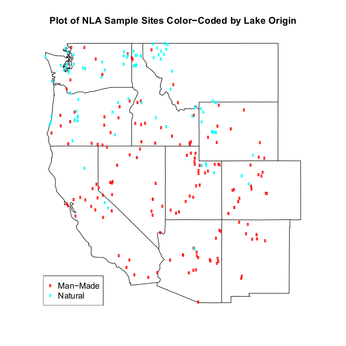

```{r setup, include = FALSE}
knitr::opts_chunk$set(
  collapse = TRUE,
  comment = "#>"
)
```

## Introduction
This document presents relative risk and attributable risk analysis of a GRTS survey design.  The resource employed in the analysis is lakes in the 48 contiguous United States.  Data was obtained from the National Lakes Survey (NLA) that was conducted in 2007 by the U.S. Environmental Protection Agency [@EPA:2009.  Relative risk measures the strength of association between stressor and response variables that can be classified as either "good" (i.e., reference condition) or "poor" (i.e., different from reference condition).  Attributable risk measures the percent reduction in the extent of poor condition of a response variable that presumably would result from eliminating a stressor variable.  Discussion regarding relative risk in the context of aquatic resource surveys is provided in Van Sickle et. al. [@VanSickle:2006] and Van Sickle and Paulsen [@VanSickle+Paulsen:2008].

## Preliminaries
The initial step is to use the `library` function to load the `spsurvey` package.  After the package is loaded, a message is printed to the R console indicating that the `spsurvey` package was loaded successfully.

Load the `spsurvey` package:
```{r load-spsurvey}
library(spsurvey)
```

## Load the survey design and analytical variables data set
The original NLA data file contains more than 1,000 records.  To produce a more manageable number of records, lakes located in the western U.S. were retained in the data that will be analyzed, which produced a data set containing 236 records.

The next step is to load the data set, which includes both survey design variables and analytical variables.  The `data` function is used to load the data set and assign it to a data frame named `NLA_2007.  The `nrow` function is used to determine the number of rows in the `NLA_2007` data frame, and the resulting value is assigned to an object named `nr`. Finally, the initial six lines and the final six lines in the `NLA_2007` data frame are printed using the `head` and `tail` functions, respectively.

Load the survey design and analytical variables data set:
```{r load.nla}
data(NLA_2007)
nr <- nrow(NLA_2007)
```

Display the initial six lines in the data file:
```{r head.nla}
head(NLA_2007)
```

Display the final six lines in the data file:
```{r tail.nla}
tail(NLA_2007)
```

The location of lakes that were sampled in the western United States is displayed in the figure below.  The sample sites are displayed using a unique color for the two values of lake origin (natural and manmade).



Relative risk analysis will be investigated by examining two response variables and three stressor variables.  The response variables are chlorophyll-a concentration for each sample site, which is a mesure of trophic condition, and an index of macroinvertebrate taxa loss that is based on modeling the ratio of observed and expected loss.  The stressor variables are total nitrogen concentration, total phosphorus concentration, and turbidity for each site.

The `relrisk.analysis` function will be used to calculate relative risk estimates.  Four data frames constitute the primary input to the `relrisk.analysis` function.  The first column (variable) in the four data frames provides the unique identifier (site ID) for each sample site and is used to connect records among the data frames.  The siteID variable in the `NLA_2007` data frame is assigned to the siteID variable in the data frames.  The four data frames that will be created are named as follows: `sites`, `subpop`, `design`, and `data.risk`.  The `sites` data frame identifies sites to use in the analysis and contains two variables: (1) siteID - site ID values and (2) Use - a logical vector indicating which sites to use in the analysis.  Since we want to include all sampled sites, the `rep` (repeat) function is used to assign the value TRUE to each element of the Use variable. Recall that nr is an object containing the number of rows in the `NLA_2007` data frame.  The `subpop` data frame defines populations and, optionally, subpopulations for which estimates are desired.  Unlike the `sites` and `design` data frames, the `subpop` data frame can contain an arbitrary number of columns.  The first variable in the `subpop` data frame identifies site ID values and each subsequent variable identifies a type of population, where the variable name is used to identify type.  A type variable identifies each site with a character value.  If the number of unique values for a type variable is greater than one, then the set of values represent subpopulations of that type.  When a type variable consists of a single unique value, then the type does not contain subpopulations.  For this analysis, the `subpop` data frame contains three variables: (1) siteID - site ID values, (2) Western_US - which will be used to calculate estimates for all of the sample sites combined, and (3) Lake_Origin - which will be used to calculate estimates for each of the two classes of lake origin (natural and manmade).  The `rep` function is used to assign values to the Western_US variable, and the Lake_Origin variable in the `NLA_2007` data frame is assigned to the Lake_Origin variable in the `subpop` data frame.  The `design` data frame consists of survey design variables.  For the analysis under consideration, the `design` data frame contains the following variables: (1) siteID - site ID values; (2) wgt - final, adjusted, survey design weights; (3) xcoord - x-coordinates for location; and (4) ycoord - y-coordinates for location.  The wgt, xcoord, and ycoord variables in the `design` data frame are assigned values using variables with the same names in the `NLA_2007` data frame.  Like the `subpop` data frame, the `data.risk` data frame can contain an arbitrary number of columns.  The first variable in the `data.risk` data frame identifies site ID values and each subsequent variable identifies a response or stressor variable. For this analysis, the response variables are Chlorophyll_a and MacroInvert_OE, and the stressor variables are Total_Nitrogen, Total_Phosphorus, and Turbidity, which are assigned, respectively, variables Chla_cond, OE5_cond, NTL_cond, PTL_cond, and Turbidity_cond in the `NLA_2007` data frame.
  
Conduct a relative risk analysis. Create the `sites` data frame, which identifies sites to use in the analysis:
```{r create.sites}
sites <- data.frame(siteID=NLA_2007$siteID,
                    Use=rep(TRUE, nr))
```

Create the `subpop` data frame:
```{r create.subpop}
subpop <- data.frame(siteID=NLA_2007$siteID,
                     Western_US=rep("Western_US", nr),
                     Lake_Origin=NLA_2007$Lake_Origin)
```

Create the `design` data frame:
```{r create.design}
design <- data.frame(siteID=NLA_2007$siteID,
                     wgt=NLA_2007$wgt,
                     xcoord=NLA_2007$xcoord,
                     ycoord=NLA_2007$ycoord)
```

Create the `data.risk` data frame:
```{r create.data.risk}
data.risk <- data.frame(siteID=NLA_2007$siteID,
                        Chlorophyll_a=NLA_2007$Chla_cond,
                        MacroInvert_OE=NLA_2007$OE5_cond,
                        Total_Nitrogen=NLA_2007$NTL_cond,
                        Total_Phosphorus=NLA_2007$PTL_cond,
                        Turbidity=NLA_2007$Turbidity_cond)
```

Names of the response and stressor variables for which relative risk estimates are desired must be specified.  The values "Chlorophyll_a" and "MacroInvert_OE" are assigned to resp_vars.  The values "Total_Nitrogen", "Total_Phosphorus", and "Turbidity" are assigned to stress_vars.

Assign response and stressor variable names:
```{r stress.resp}
resp_vars <- c("Chlorophyll_a", "MacroInvert_OE")
stress_vars <- c("Total_Nitrogen", "Total_Phosphorus", "Turbidity")
```

The `relrisk.analysis` function is used to calculate relative risk estimates.  In the call to function `relrisk.analysis`, arguments response.var and stressor.var provide the names of columns in the `data.risk` data frame that contain response variables and stressor variables, respectively.  The `rep` function is used to repeat each of the response variable names in resp_vars once for each of the stressor variable names in stress_vars and the result is assigned to the response.var argument.  Similarly, the `rep` function is used to repeat the set of stressor variable names in stress_vars once for each of the values in resp_var and the result is assigned to the stressor.var argument.  The result is that `relrisk.analysis` will calculate a relative risk estimate for each combination of response and stressor variables.

Calculate relative risk estimates:
```{r calc.rel.risk}
RelRisk_Estimates <- relrisk.analysis(sites, subpop, design, data.risk,
   response.var= rep(resp_vars, each=length(stress_vars)),
   stressor.var=rep(stress_vars, length(resp_vars)))
```

The relative risk estimates are displayed using the `print` function.  The object produced by `relrisk.analysis` is a data frame containing twentyone columns.  The first five columns identify the population (Type), subpopulation (Subpopulation), response variable (Response), stressor variable (Stressor), and number of response variable (or stressor variable) values used to calculate the relative risk estimate (NResp).  The next six columns provide results for the relative risk estimate: the estimate (Estimate), numerator of the estimate (Estimate.num), denominator of the estimate (Estimate.denom), logarithm of the standard error of the estimate (StdError.log), lower confidence bound (LCB95Pct), and upper confidence bound (UCB95Pct).  Argument conf for `relrisk.analysis` allows control of the confidence bound level.  The default value for conf is 95, hence the column names for confidence bounds contain the value 95.  Supplying a different value to the conf argument will be reflected in the confidence bound names.  Confidence bounds are obtained using the logarithm of standard error and the Normal distribution multiplier corresponding to the confidence level.  Results are then backtransformed to the original scale to obtain the confidence bound estimates.  The next column in the data frame contains the sum of the survey design weights (WeightTotal).  The next four columns provide cell counts for the two-by-two table of response variable categories and stressor variable categories and are named CellCounts.rc, where r indicates row number in the table and c indicates column number.  Rows contain the response variable categories and column contain the stressor variable categories.  By default, number 1 is the "Poor" category, and number 2 is the "Good" category.  The final four columns in the data frame contain the cell proportion estimates for the two-by-two table, where columns are named CellProportions.rc using the same convention as the cell count columns.  Note that the cell proportion estimates are weighted estimates obtained using the survey design weights.

Print the relative risk estimates:
```{r print.rel.risk.ests}
print(RelRisk_Estimates)
```

The `write.csv` function is used to store the relative risk estimates as a comma-separated value (csv) file.  Files in csv format can be read by programs such as Microsoft Excel.

Write results as a comma-separated value (csv) file:
```{r write.rel.risk}
write.csv(RelRisk_Estimates, file="RelRisk_Estimates.csv", row.names=FALSE)
```

## Attributable risk analysis
The `attrisk.analysis` function will be used to calculate attributable risk estimates.  The four data frames used to calculate relative risk estimates can be used for attributable risk estimation.  Arguments for the `attrisk.analysis` function are identical to arguments for the `relrisk.analysis` function

Calculate attributable risk estimates:
```{r att.risk.ests}
AttRisk_Estimates <- attrisk.analysis(sites, subpop, design, data.risk,
   response.var= rep(resp_vars, each=length(stress_vars)),
   stressor.var=rep(stress_vars, length(resp_vars)))
```

The attributable risk estimates are displayed using the print function.  The object produced by `attrisk.analysis` is a data frame containing nineteen columns.  The data data frame is identical to the one produced by the `relrisk.analysis` function except that it doesn't include the columns named Estimate.num and Estimate.denom.  Since attributable risk is not calculated using a ratio estimator, values for numerator and denominator estimates are not relevant.

Print the attributable risk estimates:
```{r print.att.risk.ests}
print(AttRisk_Estimates)
```

The write.csv function is used to store the attributable risk estimates as a csv file. Write results as a csv file:
```{r write.att.risk.ests}
write.csv(AttRisk_Estimates, file="AttRisk_Estimates.csv", row.names=FALSE)
```

## References