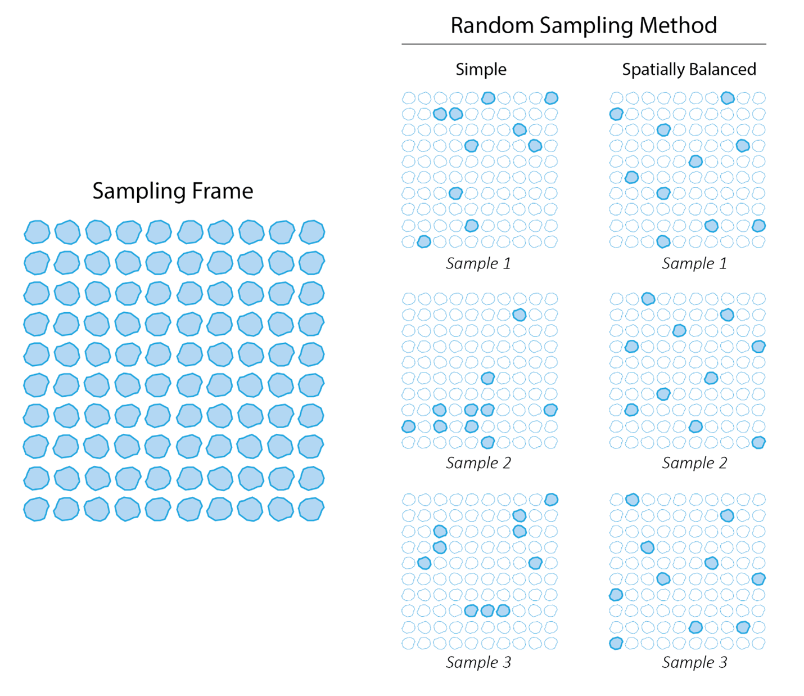
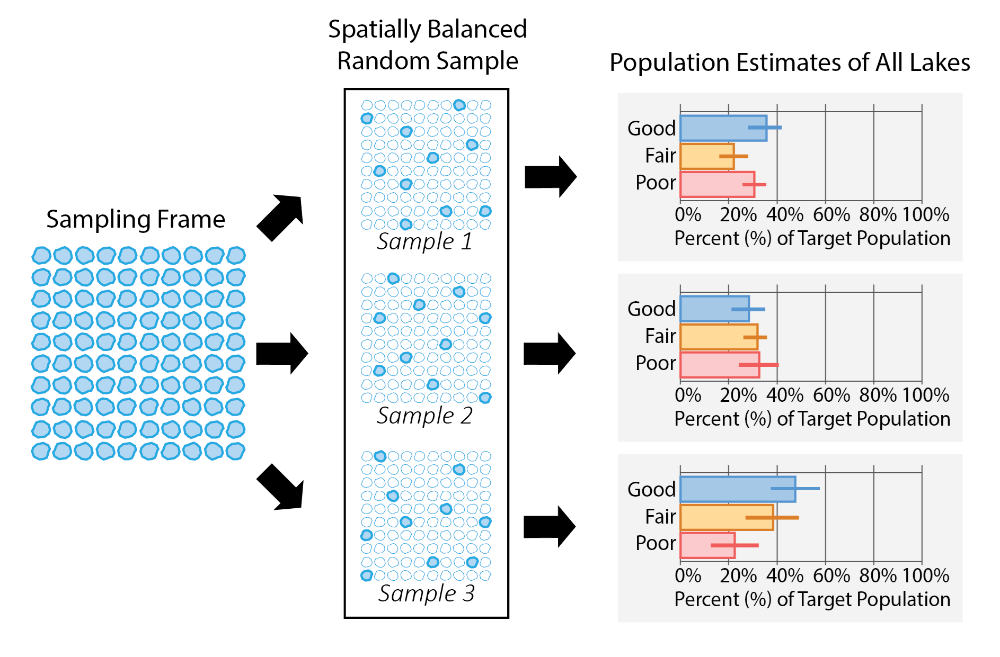
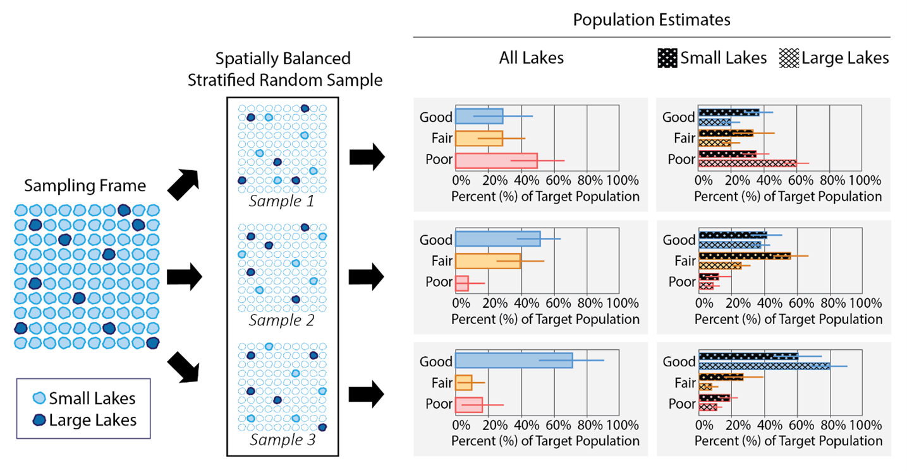

```{r, include = FALSE}
knitr::opts_chunk$set(
  collapse = TRUE,
  comment = "#>", 
  warning = FALSE, 
  message = FALSE
)
```

# Introduction

Statistical surveys provide a framework to help scientists answer important questions like "What proportion of lakes in a region of interest (e..g, a district, state, country, etc.) support healthy populations of fish?" When we want to answer questions about a set of units (e.g., all lakes in the region of interest), it is not usually feasible to collect data at every unit because of financial or time constraints. Statistical surveys select a random sample[^1] of units and use the resulting data to infer broad characteristics about all units. The "random" part of the random sampling is particularly important, ensuring the sample selection process remains unbiased and that results are able to be generalized to the broader population of interest (Paulsen et al., 1998). Random sampling also ensures our analyses accurately reflect the characteristics we want to measure with a known margin of error and appropriate confidence intervals. Below, details of each aspect of a statistical survey are presented, from defining a target population to interpreting the statistical estimates and everything in between. We focus on applications to aquatic resources (e.g., lakes, streams, estuaries), but this discussion also applies to myriad other ecological contexts (e.g., forestry, biology, wildlife, etc.)

[^1]: For ecological monitoring projects, it is important to note the difference between the statistical use of "sample" or "sampling" and the ecological use of the word. In ecological monitoring, sampling means collection of chemical, physical, or biological data. To reduce confusion, we will refer to "ecological sampling" as monitoring or data collection, and "sampling" and "sample units" as part of the statistical design process.

# Statistical Survey Components

## Target Population (i.e., Population of Interest)

The target population (i.e., population of interest) is the set of units we want to describe. This definition should be clear, concise, and easy to confirm during data collection (e.g., by field crews). For example, a target population definition may be "All natural and constructed freshwater lakes in a region of interest not used for aquaculture or disposal (e.g., mine tailings, sewage treatment), greater than 1 hectare with more than 1,000 square meters of open water, and greater than 1 meter in depth." In this example, the field crews could easily determine on-site whether all five criteria in this definition are met. It is crucial that the target population definition aligns with the statistical survey’s goals.

## Sampling Frame

When developing a statistical survey, statisticians refer to the units available for sampling as "sample units" (i.e., individual lakes). For use in the statistical survey process, these units are contained in a sampling frame.

Sampling frames for natural resources are often represented using a Geographic Information System (GIS) with spatial information like latitude and longitude coordinates. Ideally, the sampling frame and target population coincide (i.e., the GIS coverage contains all lakes in the region of interest that meet the aforementioned target population definition and omits all lakes that do not). In practice, however, it is common for a portion of sample units identified in the sampling frame to not meet the target population definition. For example, the target population definition excludes stormwater ponds, but these ponds may incorrectly appear as lakes in a GIS coverage. This is called "overcoverage." On the other hand, a portion of sample units that exist on the landscape and meet the target population definition may be missing from the GIS coverage because coverage is imperfect. This is called "undercoverage." Handling overcoverage and undercoverage requires subject matter expertise and additional analysis and interpretation techniques.

## Selecting a Random Sample

To ensure a sample is unbiased and representative of the target population, it should be randomly selected. One approach to random sampling is to select a simple random sample, whereby each sample is equally likely. However, simple random samples ignore the spatial distribution of units on a landscape, often yielding samples that have noticeable spatial gaps or an excess of units in certain areas (i.e., clumping). One approach to alleviating this drawback is the Generalized Random Tessellation Stratified (GRTS) algorithm (Stevens and Olsen, 2004), which generates random samples that are well-spread in space, or spatially balanced. The `spsurvey` **R** package makes GRTS sampling available via the `grts()` function.

### Example: Part 1

Suppose a region of interest has 100 lakes and the goal is to use a random selection of 10 lakes to draw inferences about the target population. The random sample may or may not be spatially balanced. Figure 1 compares simple random sampling and spatially balanced random sampling.

```{r, echo=FALSE, fig.cap="Figure 1: Comparison of two random sampling methods.  A simple random sampling method to select 10 lakes from a sampling frame of 100 produces samples while ignoring their spatial distribution. This can result in some samples clumping while others do not. In comparison, a spatially balanced random sampling method accounts for the sample distribution and produces a sample well-spread in space."}

```

## Design Weights

A design weight is a continuous, numeric value assigned to each unit in the sample that represents similarity to other units not selected in the sample. For example, if a unit sampled has a design weight of 10, it represents ten similar units from the sampling frame (and more broadly, the target population). When each sample unit has an equal chance of being selected, all weights are equal.

## Target Population Parameter Estimates

Design weights are combined with observed data for each sampled unit (e.g., fish species richness) to estimate target population parameters like means, proportions, and totals that inform the original research question(s). For example, based on the sample and observed data, a researcher may estimate that 34.6% of lakes in the region of interest have fish populations in good condition, with a 95% confidence interval of 26.4% to 42.8%.

### Example: Part 2

Three separate spatially balanced random samples of 10 lakes are selected from the sampling frame of 100 lakes (Figure 2). Each sampled lake is assigned a weight of 10, meaning that each site represents and equal proportion of 10 similar lakes in the sampling frame. The weights are combined with data at each site to estimate the proportion of the target population in either Good, Fair, or Poor condition.

```{r, echo=FALSE, fig.cap="Figure 2: An overview of the survey design process.  Three different spatially balanced random samples produces three different sets of population estimates."}

```

## Stratification

Sometimes stratification is used as part of the design process to ensure random samples are evenly distributed among different strata (i.e., groups). For example, small lakes are more prevalent than large lakes on the landscape, so a random sample ignoring lake size would yield mostly small lakes. As a result, the final dataset would not have very much information on large lakes. However, sample sizes can be set separately for small and large lakes by stratifying, allowing the selection of similarly sized spatially balanced samples for each group. By stratifying the sample selection into such subgroups (sometimes called subpopulations), we more effectively ensure the sample accurately reflects the characteristics of each subgroup within the overall population. Additionally, stratifying ensures that enough sites can be selected in each group to allow for comparisons between them (i.e., comparing small lakes with large lakes in the analyses).

Stratifying changes the likelihood of some units being selected; therefore, the design weights must be adjusted to account for those unequal selections.

### Example: Part 3

Suppose of the 100 lakes in the sampling frame, 90 are small lakes and 10 are large lakes. Selecting 10 sites randomly does not guarantee a specific distribution of small and large lakes. For example, one random sample could select 10 small lakes and 0 large lakes, another could select 9 small lakes and 1 large lake, and yet another could select 3 small lakes and 7 large lakes. In an unstratified random sample (as in Example: Part 2), each of these lakes, whether small or large, would be assigned a weight of 10. While the sample would represent all lakes, reporting on small lakes and large lakes separately may be difficult, or even impossible, due to sample size constraints. For example, if 10 small lakes and 0 large lakes are selected, reporting on large lakes as a subgroup is impossible.

A stratified random sample is used to select a prespecified number of sites from each group (or "stratum") – in Figure 3, for example, 5 small lakes and 5 large lakes. Because the sites in these strata now represent different portions of the sampling frame, the weights will be different between the two groups. Each of the 5 small lakes will represent an equal proportion of the 90 small lakes in the sampling frame and receive a weight of 18, while each of the 5 large lakes will represent an equal proportion of 10 lakes in the sampling frame and receive a receive a weight of 2. Stratification ensures that there are enough small lakes and large lakes sampled to draw inferences for both groups separately.

Another twist: Sometimes lakes cannot be sampled (e.g., lack of access, lake is dry, etc.). When data was not collected from a sample unit, statisticians call this "nonresponse". The reason for nonresponse informs approaches that statisticians use to adjust the original weights to account for this missing data, ensuring the sample remains representative of the target population.

```{r, echo=FALSE, fig.cap="Figure 3: Applying stratification to a spatially balanced random sample.  Stratifying by small lakes and large lakes selects an equal sample size of both groups, allowing for all lakes to be reported in addition to both small lakes and large lakes separately."}

```

### Stratification Tradeoffs

A benefit of stratification is that units in subgroups are guaranteed to be sampled the desired number of times, and thus, reporting for that subgroup is possible. A drawback of stratification, however, is that increasing samples in small subgroups requires decreasing samples in large subgroups, which can increase uncertainty associated with large-scale (e.g., national) population estimates. These benefits and drawbacks should be evaluated and prioritized when designing a statistical survey.

# Point, Linear, and Areal Resources

A **point resource** is represented by a POINT geometry in a GIS and encompasses a finite collection of units in the sampling frame. Lakes, treated as a whole with location represented as a single centroid, are an example of a point resource; there are a finite, defined number of individual lakes to sample. In contrast, a **linear resource** is represented by a LINESTRING geometry in a GIS and encompasses an infinite number of units in the sampling frame. An example of a linear resource is a stream network; there are an infinite number of possible locations to sample along the length of any given stream. Finally, an **areal resource** is represented by a POLYGON geometry in a GIS and, like a linear resource, encompasses an infinite number of units in the sampling frame. Examples of areal resources include an estuary; there are an infinite number of possible locations to sample within the boundaries of any given estuary.

Survey design principles are consistent regardless of resource type. However, the interpretation of the weights and resulting population estimates do change depending on the resource type (Table 1).

| Resource Types | Units            | Example Interpretation                                                         |
|----------------|------------------|--------------------------------------------------------------------------------|
| Point          | Individual Units | Each weight represents a number of individual lakes similar to the one being sampled; population estimates are for all lakes in the target population                                |
| Linear         | Lengths          | Each weight represents a number of stream miles similar to the reach being sampled; population estimates are for all stream miles in the target population                                |
| Areal          | Areas            | Each weight represents the area similar to the estuary site being sampled; population estimates are for all square miles of estuary in the target population                 |

: Table 1: Differences across resource types

# Conclusion

Ecological and environmental monitoring efforts can significantly benefit from incorporating statistical surveys. Statistical surveys leverage a target population definition, a sampling frame, a random sampling mechanism that may be spatially balanced, design weights, and target population parameter estimates to answer scientific questions of interest. `spsurvey` provides tools for users to select spatially balanced GRTS samples of point, linear, and areal resources, construct design weights, and estimate target population parameters (Dumelle et al., 2023). Please see the other vignettes on our website ([at this link](https://usepa.github.io/spsurvey/) in the "Articles" tab) to learn more. 
# References

Dumelle, Michael and Kincaid, Tom and Olsen, Anthony R., and Weber, Marc. (2023). spsurvey: Spatial Sampling Design and Analysis in R. *Journal of Statistical Software*, 105(3), 1-29.

Paulsen, Steven and Hughes, Robert M. and Larsen, David P. (1998). Critical Elements in Describing and Understanding our Nation's Aquatic Resources. *Journal of the American Water Resources Association*, 34(5), 995-1005.

Stevens Jr, D. L. and Olsen, A. R. (2004). Spatially balanced sampling of natural resources. *Journal of the American Statistical Association*, 99(465):262-278.
